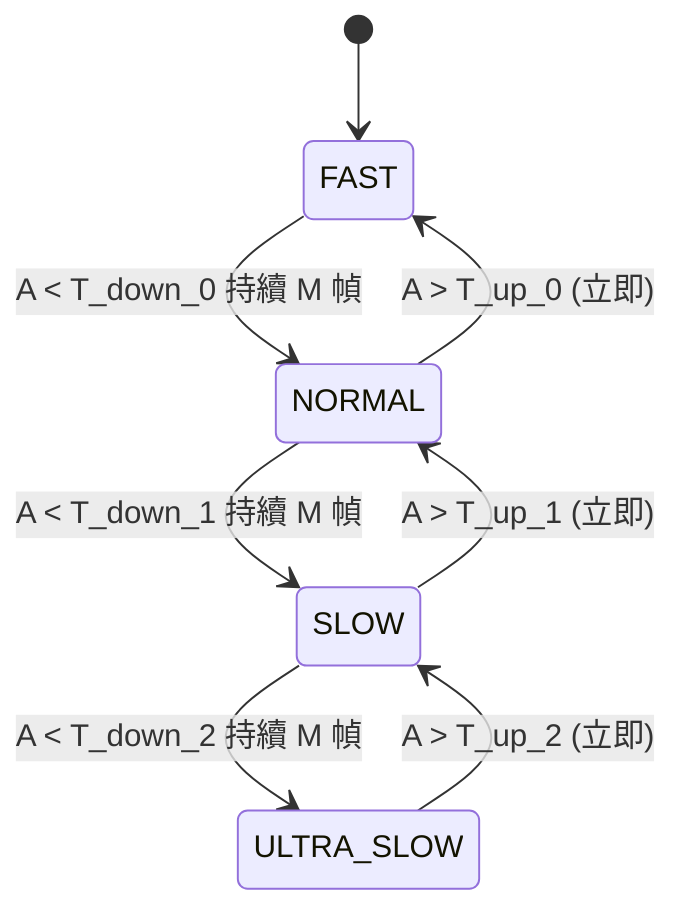
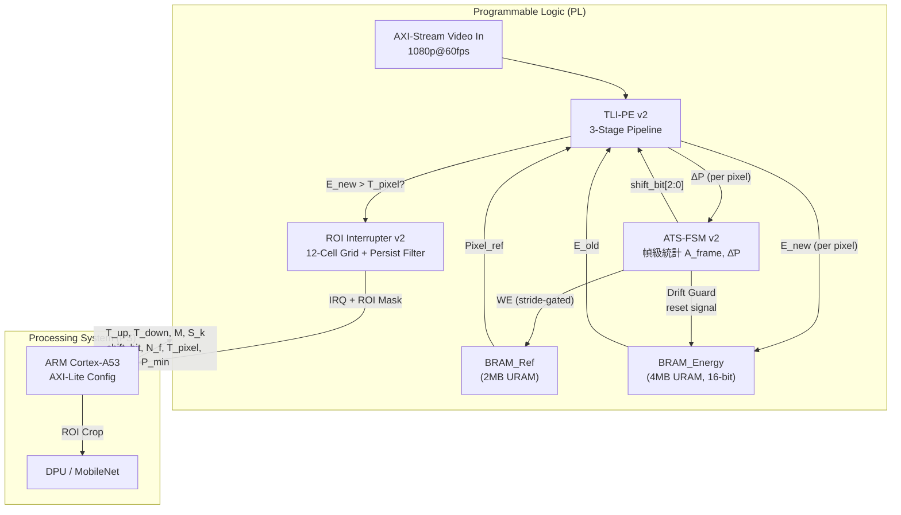

# ATS-FD 加速器：可行性評估、改進設計與參考文獻指南

---

## 〇、你的原始設計概覽

````carousel

<!-- slide -->

<!-- slide -->

<!-- slide -->

````

---

## 壹、可行性結論

> [!IMPORTANT]
> **結論：完全可行，且方向正確。** 你的加速器核心思路——透過「凍結參考幀 + 時域漏失積分」來放大慢速物體的微小差值信號——在數學上與工程上都站得住腳。以下是三個判斷依據。

### 1.1 物理原理可行性

教授論文中 Limitation_02 的根本問題是：

$$\Delta P_{\text{single-frame}} = |I_t(x,y) - I_{t-1}(x,y)| \leq T \quad \Rightarrow \quad \text{漏報}$$

你的 ATS-FD 做的事情等效於將時間跨度從 1 幀拉到 $N$ 幀：

$$\Delta P_{\text{stride-N}} = |I_t(x,y) - I_{t-N}(x,y)| \gg \Delta P_{\text{single-frame}}$$

對於一個以恆定速度 $v$（pixels/frame）移動的物體，差值信號與時間跨度成正比：$\Delta P \propto v \cdot N$。這意味著只要 $N$ 夠大，即使 $v$ 極小，$\Delta P$ 仍可超過閾值 $T$。**這是數學保證**。

### 1.2 資源可行性

你選擇 ZCU104（Zynq UltraScale+ MPSoC）作為目標平台。透過「控制 WE 訊號而非儲存多幀」的設計，PL 端僅需：

| 記憶體 | 用途 | 容量 |
|------|------|------|
| BRAM\_Ref | 單張灰階參考幀 | 1920×1080×8bit ≈ 2MB |
| BRAM\_Energy | 能量圖 | 1920×1080×8bit ≈ 2MB |
| **合計** | | **≈ 4MB** |

ZCU104 的 PL 端配備 11MB URAM + 3.5MB BRAM = 14.5MB 片上記憶體。4MB 的需求完全在預算之內，甚至還有大量餘裕。**Zero-DDR-Access 的約束可以滿足。**

### 1.3 架構適配性

你的三模組 Pipeline 正精確地對準了教授論文系統的「第一關缺口」：

```
教授論文：Frame Diff (固定 Stride=1) → Threshold → ROI → AI Classifier
你的設計：Frame Diff (自適應 Stride) → Leaky Integrator → Smart ROI → IRQ → PS 端 AI Classifier
```

你沒有企圖替換整個系統，而是**精準替換了導致 Limitation_02 的第一關模組**，下游仍然復用教授的 MobileNet 分類器。這種「手術刀式」的改進在論文貢獻度敘述上非常有力。

---

## 貳、改進後的完整微架構設計

以下不是「你哪裡錯、改哪裡」，而是我將想法融入你的原始設計後，重新完整闡述的三個模組。

---

### 模組一：自適應時域步長狀態機（ATS-FSM v2）

#### 整體設計理念

原始設計的 FSM 只有兩個檔位：FAST\_MODE（Stride=1）和 SLOW\_ACCUM\_MODE（Stride=N, 固定 N=30）。這個二元切換在慢速物體的語境下存在兩個工程問題：第一，從 FAST 到 SLOW 的模式切換邊界上，若場景活動量在閾值附近震盪，FSM 會在兩個狀態之間反覆跳動（Mode Chattering），導致參考幀更新時機混亂。第二，固定的 N=30 不能適應不同速度等級的物體——一個以 0.5 pixels/frame 移動的物體需要的 stride 跟以 0.05 pixels/frame 移動的物體截然不同。

改進後的 ATS-FSM v2 引入**三個機制**：多級步長階梯、遲滯切換邏輯、以及背景漂移保護。

#### 多級步長階梯（Multi-Level Stride Ladder）

FSM 不再是二元切換，而是一個具備四個速度檔位的階梯式控制器。每個檔位對應一個 stride 值，即 BRAM\_Ref 的 WE 每隔多少幀才拉起一次：

| 狀態 | 代號 | Stride $S$ | WE 更新間隔 | 適用場景 |
|------|------|-----------|---------|-------|
| S0 | `FAST` | 1 | 每幀更新 | 快速物體、場景劇變 |
| S1 | `NORMAL` | 8 | 每 8 幀更新（≈133ms @60fps） | 中速物體 |
| S2 | `SLOW` | 30 | 每 30 幀更新（≈500ms） | 慢速物體 |
| S3 | `ULTRA_SLOW` | 120 | 每 120 幀更新（≈2 秒） | 極慢速物體 |

FSM 在每個 VSYNC（幀末）時刻讀取幀級活動量指標 $A_{\text{frame}}$——即該幀中 $E_{\text{new}} > T_{\text{pixel}}$ 的像素總數（這個計數器由 TLI-PE 模組的輸出驅動，用一個簡單的硬體加法器在掃描過程中遞增即可）——來決定向哪個檔位轉移。

#### 遲滯切換邏輯（Hysteresis Guard）

為了防止 Mode Chattering，每一對相鄰檔位之間配置兩個不同的閾值——**上行閾值** $T_{\text{up}}$ 和**下行閾值** $T_{\text{down}}$，且 $T_{\text{up}} > T_{\text{down}}$。狀態轉移規則：

- **降檔（從快到慢）**：$A_{\text{frame}} < T_{\text{down},k}$ 持續 $M$ 幀 → 進入下一個更慢的檔位
- **升檔（從慢到快）**：$A_{\text{frame}} > T_{\text{up},k}$ → 立即升檔（不需持續計數，因為快速反應更重要）

這裡「持續 $M$ 幀才降檔」是一個穩態確認機制（Dwell Counter），確保 FSM 不會因為單幀噪聲波動就誤降檔。硬體上只需要一個小的計數器暫存器。而升檔是立即的，因為場景突然出現運動時必須快速反應。



每一組 $T_{\text{up},k}$、$T_{\text{down},k}$、$M$ 以及每個檔位的 stride 值 $S_k$，全部透過 AXI-Lite 暫存器暴露給 PS 端，允許軟體在運行時動態調參。硬體只負責執行 FSM 邏輯，所有策略參數由 PS 端控制。

#### 背景漂移保護（Background Drift Guard）

在 ULTRA\_SLOW 模式下，參考幀被凍結長達 2 秒。在這段時間內，場景的全局照度可能因為雲層移動、室內燈光變化等因素發生緩慢漂移。如果不處理，這種全局漂移會被誤認為「所有像素都在運動」，導致能量圖整體升高、False Positive 暴增。

保護機制：FSM 在每個 VSYNC 時刻，除了統計 $A_{\text{frame}}$（超過閾值的像素數）之外，同時統計**全圖像素差值的平均值** $\bar{\Delta P}$。如果 $\bar{\Delta P}$ 超過一個全局漂移閾值 $T_{\text{drift}}$，FSM 強制執行一次參考幀更新（拉起 WE 一幀），然後清零 BRAM\_Energy 中的所有值。這等效於一個「硬重置」：場景照度已經變了，舊的參考幀和累積的能量圖都失效了，不如乾淨重來。

$\bar{\Delta P}$ 的硬體計算：在 TLI-PE 的 Stage 1 輸出 $\Delta P$ 的同時，用一個並行的累加器將所有像素的 $\Delta P$ 加總，幀末除以像素總數（1920×1080 ≈ $2^{21}$，可用右移 21 位近似）。這只需要一個 32-bit 累加器和一個移位器。

---

### 模組二：時域漏失積分處理單元（TLI-PE v2）

#### 整體設計理念

原始設計的 TLI-PE 使用 8-bit 能量路徑和固定的移位衰減因子。這在「慢速物體」的專用領域下會遇到動態範圍不足的問題。8-bit 最大值 255，若衰減太慢（移位量小），能量圖很快飽和到 255 且到處都是 255（失去空間區分度）；若衰減太快（移位量大），慢速物體剛累積起來的微弱信號還沒來得及超過閾值就被衰減掉了。此外，即使在完全靜止的場景中，感測器自身的讀出噪聲（Temporal Sensor Noise）也會產生微小但非零的 $\Delta P$，經過長時間積分後會在能量圖上緩慢堆積，形成均勻的「噪聲地板」（Noise Floor），進一步擠壓真正慢速物體信號的可用動態範圍。

改進後的 TLI-PE v2 引入三項工程修正：拓寬能量路徑至 16-bit、加入噪聲地板扣除、以及讓衰減因子跟隨 FSM 檔位自動切換。

#### 拓寬能量路徑至 16-bit

BRAM\_Energy 中每個像素的能量值從 8-bit 拓寬為 16-bit。這使得能量圖的記憶體需求從 ~2MB 增加到 ~4MB（1920×1080×16bit ≈ 4MB）。加上 BRAM\_Ref 的 2MB，PL 端總記憶體需求為 6MB，仍在 ZCU104 的 14.5MB 預算之內。

拓寬的意義在於：最大值從 255 增加到 65535，提供了 256 倍的動態範圍餘裕。慢速物體的信號可以在不飽和的前提下充分累積，而閾值 $T_{\text{pixel}}$ 也可以設定到一個遠高於噪聲地板的值，從而獲得更好的信噪比。

管線化結構仍為 3-Stage，Initiation Interval 仍為 1。硬體改動僅在於：Stage 2 的移位器和 Stage 3 的加法器從 8-bit 改為 16-bit，增加的邏輯資源微乎其微。BRAM\_Energy 由原來的單個 BRAM 陣列改為一對 BRAM 拼接（或使用 URAM），雙埠讀寫行為不變。

#### 噪聲地板扣除（Noise Floor Subtraction）

在 Stage 1（Fetch & Diff）和 Stage 3（Saturating Add & Write-Back）之間，插入一個減法操作。新的更新公式為：

$$E_{\text{new}} = \text{clamp}\!\Big(\big(E_{\text{old}} \gg \text{shift\_bit}\big) + \Delta P - N_f,\;\; 0,\;\; 65535\Big)$$

其中 $N_f$ 是噪聲地板估計值（Noise Floor），是一個透過 AXI-Lite 暫存器由 PS 端寫入的可配置常數。`clamp` 操作同時防止上溢（超過 65535 飽和到 65535）和**下溢**（低於 0 截止到 0）。

$N_f$ 的物理意義：在一個完全靜止的場景中，感測器噪聲每幀產生的平均 $\Delta P$ 就是噪聲地板。PS 端可以在系統初始化時量測數十幀靜態場景的平均 $\Delta P$，將其寫入 $N_f$ 暫存器。之後 TLI-PE 在每個時脈的累加過程中自動扣除這個噪聲貢獻，使得純靜止區域的能量值會自然衰減至 0，而真正有物體移動的區域的能量值才會穩定成長。

硬體代價：僅多一個 16-bit 減法器和一個下溢截止邏輯（if result < 0 then 0），完全可以吸收進 Stage 3 的既有加法器管線級中，不額外增加 pipeline stage。

#### 衰減因子跟隨 FSM 檔位自動切換

原始設計中 `shift_bit` 是固定常數。改進後，`shift_bit` 由 ATS-FSM v2 的當前狀態直接驅動：

| FSM 狀態 | Stride $S$ | `shift_bit` | 衰減因子 $\alpha = 2^{-\text{shift\_bit}}$ | 設計理由 |
|---------|-----------|-------------|--------------------------------------|--------|
| `FAST` | 1 | 2 | 1/4 | 快速衰減，跟蹤快速場景變化 |
| `NORMAL` | 8 | 3 | 1/8 | 中等衰減 |
| `SLOW` | 30 | 5 | 1/32 | 慢衰減，讓慢速信號充分累積 |
| `ULTRA_SLOW` | 120 | 7 | 1/128 | 極慢衰減，保存極微弱信號 |

硬體實現：`shift_bit` 是一個 3-bit 寬的控制信號，由 FSM 直接連線到 TLI-PE 的 Stage 2 桶型移位器（Barrel Shifter）的移位量輸入端。桶型移位器本身就支援可變移位量，不需要額外的 MUX 或控制邏輯。

這樣做的效果是：當 FSM 判定場景進入慢速階段，衰減因子自動變小——累積的能量消散得更慢——慢速物體的微弱 $\Delta P$ 可以一幀一幀地疊加上去，而不會每次被大幅衰減回去。

#### 改進後的完整管線

```
Stage 1 (Fetch & Diff):
    讀取 BRAM_Ref → 計算 ΔP = |Pixel_current - Pixel_reference|
    （並行：ΔP 饋送給全局累加器，用於計算 A_frame 和 Δ̄P）

Stage 2 (Energy Read & Shift):
    讀取 BRAM_Energy[X,Y] → E_old
    E_decayed = E_old >> shift_bit[由 FSM 狀態驅動]

Stage 3 (Noise Sub & Saturating Add & Write-Back):
    E_raw = E_decayed + ΔP - N_f
    E_new = clamp(E_raw, 0, 65535)
    寫回 BRAM_Energy[X,Y] ← E_new
    （並行：若 E_new > T_pixel，觸發 ROI 座標更新）
```

---

### 模組三：智慧中斷定址控制器（Smart ROI Interrupter v2）

#### 整體設計理念

原始設計在單幀內追蹤一個全局 Bounding Box（$X_{\min}, X_{\max}, Y_{\min}, Y_{\max}$），幀末判斷是否有效後觸發一次中斷。這個設計在快速物體場景下是足夠的，但在慢速物體場景下面臨一個特有的挑戰：**時域假陽性**。即使有了噪聲地板扣除，偶爾的突發噪聲（如一隻蟲子飛過鏡頭、一陣風吹動樹葉）仍可能在某一幀中使若干像素的能量值突破閾值，產生一個短暫但虛假的 ROI。如果每次都觸發中斷喚醒 PS 端跑 MobileNet，這些 False Positive 會消耗不必要的能量。

改進後的 ROI Interrupter v2 引入兩個機制：時域持續性濾波器（Temporal Persistence Filter）和多 ROI 支援。

#### 時域持續性濾波器（Temporal Persistence Filter）

在原始的幀級 ROI 判定邏輯之後，增加一個**持續性計數器** $C_{\text{persist}}$：

- 若本幀有有效 ROI（$X_{\max} > X_{\min}$），$C_{\text{persist}} \leftarrow C_{\text{persist}} + 1$
- 若本幀無有效 ROI，$C_{\text{persist}} \leftarrow 0$（重置）
- **只有當 $C_{\text{persist}} \geq P_{\min}$ 時**，才真正觸發硬體中斷

$P_{\min}$ 是「持續性閾值」，透過 AXI-Lite 暫存器配置。例如 $P_{\min} = 5$ 表示一個 ROI 必須連續 5 幀都出現，才被認定為真正的運動目標並通報 PS 端。

這個濾波器的效果：一隻飛過的蟲子只會觸發 1-2 幀的 ROI，不會滿足持續性要求，被自動過濾。而一個真正在慢速移動的物體，其累積的能量值一旦突破閾值，會在後續的每一幀都持續超過閾值（因為 TLI-PE 的衰減很慢），輕鬆滿足持續性條件。

硬體代價：一個 8-bit 計數器 + 一個比較器 + 一個 AND 閘（與中斷觸發線做 AND）。

#### 多 ROI 支援（Multi-ROI via Grid Partitioning）

原始設計追蹤單一全局 Bounding Box。這意味著如果畫面左上角和右下角同時有兩個慢速物體，輸出的 ROI 會是一個覆蓋整個畫面的巨大矩形，AI Classifier 收到的 ROI 幾乎等於全圖，失去了 ROI 裁切的意義。

改進方案：將 1920×1080 的畫面均勻分割為 $G_x \times G_y$ 的網格（例如 $4 \times 3 = 12$ 個 Cell，每個 Cell 約 480×360 像素）。每個 Cell 各自獨立維護自己的 Bounding Box（$X_{\min}^{(i)}, X_{\max}^{(i)}, Y_{\min}^{(i)}, Y_{\max}^{(i)}$）和持續性計數器 $C_{\text{persist}}^{(i)}$。

硬體結構：
- 12 組獨立的 Min/Max Comparator + Bounding Box 暫存器（每組 4 個 16-bit 暫存器 = 8 bytes，12 組 = 96 bytes，微不足道）
- 12 個獨立的持續性計數器
- 幀末時，所有滿足持續性條件的 Cell 的 Bounding Box 被打包成一個中斷報文

中斷報文結構（AXI-Lite 暫存器映射）：
- `REG_ROI_VALID_MASK`（12-bit）：每一位表示對應 Cell 是否有有效的、通過持續性濾波的 ROI
- `REG_ROI_0_BBOX` 到 `REG_ROI_11_BBOX`：每組 4 個 16-bit 暫存器

PS 端被中斷喚醒後，先讀取 `REG_ROI_VALID_MASK`，只對 mask 為 1 的 Cell 讀取 Bounding Box 並裁切 ROI 送入 DPU。

#### 改進後的完整幀末邏輯

```
每幀 VSYNC 下降緣觸發：

1. 對每個 Grid Cell i = 0..11:
   if (X_max[i] > X_min[i]):  // 本幀有有效像素
       C_persist[i] += 1
   else:
       C_persist[i] = 0
   
   if (C_persist[i] >= P_min):
       valid_mask[i] = 1
   else:
       valid_mask[i] = 0

2. if (valid_mask != 0):  // 至少有一個 Cell 有有效 ROI
       觸發硬體中斷（IRQ）
       將 valid_mask 和所有 Bounding Box 寫入 AXI-Lite 暫存器

3. 重置所有 Cell 的 X_min, Y_min = MAX, X_max, Y_max = 0
```

---

### 模組間連線總覽



---