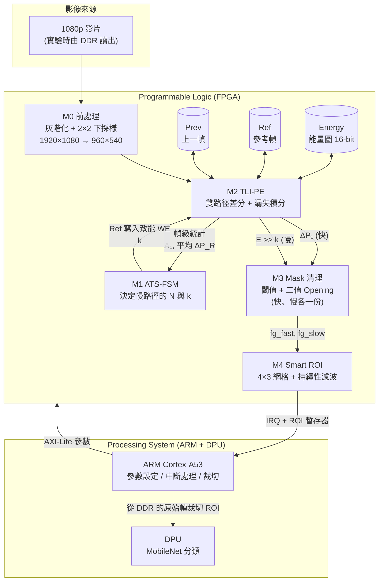
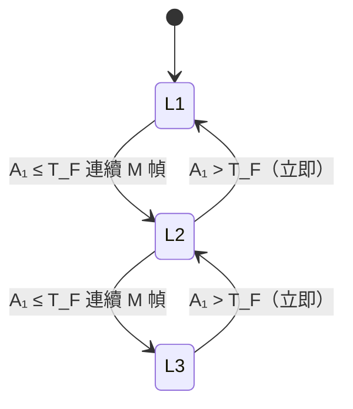
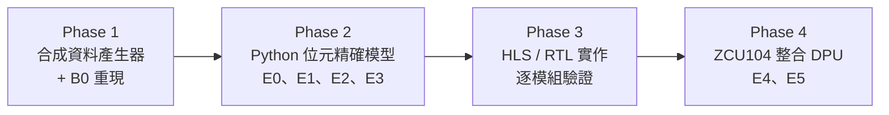

# ATS-FD 實驗設計：讓 Frame Differencing 看得見慢速物體

*基於 [Limitation of Pro's Article Analysis.md](Limitation%20of%20Pro's%20Article%20Analysis.md)（以下簡稱「分析文件」）*

---

## 〇、閱讀指南

### 0.1 一分鐘版本（給教授 / 組員的電梯簡報）

> 教授論文的偵測方法只比較**相鄰兩幀**，慢速物體在一幀之內幾乎沒有移動，差值太小，第一關就被刪掉，分類器根本沒機會看到它。
>
> 我們的 ATS-FD 加速器在 FPGA 上同時跑兩條偵測路徑：
> - **快路徑**：保留教授的相鄰幀差分，負責快速物體。
> - **慢路徑**：把比較對象換成「好幾幀以前的參考幀」，讓慢速物體的位移累積到看得見，再用一個「會漏水的水桶」（漏失積分）記住微弱的變化。
>
> 一個狀態機根據快速活動的多寡，自動調整慢路徑的參考幀要凍結多久。只有通過持續性檢查的 ROI 才會喚醒 ARM 跑 MobileNet，維持教授方法的低能耗優勢。
>
> 實驗要證明三件事：(1) 可偵測的最低速度降低數十倍以上；(2) 誤報率沒有因此上升；(3) 能耗仍然遠低於每幀都跑神經網路。

### 0.2 這份文件的結構

| 章節 | 內容 | 讀完應該能回答 |
|---|---|---|
| 一 | 研究問題、假說、貢獻 | 我們要證明什麼？ |
| 二 | 核心直覺（全部用比喻） | 為什麼這個方法會有效？ |
| 三 | 系統總覽 | 資料怎麼流動？哪些在 FPGA、哪些在 ARM？ |
| 四 | 各模組詳細設計＋數學推導 | 每個公式在做什麼？參數怎麼選？ |
| 五 | 硬體資源與時序計算 | 放得進 ZCU104 嗎？速度夠嗎？ |
| 六 | 一個完整的數值範例 | 一個慢慢走的行人，從出現到被偵測，每一步發生什麼？ |
| 七 | 實驗計畫 | 要做哪些實驗、量什麼、和誰比？ |
| 八 | 執行順序 | 先做什麼後做什麼？ |
| 九 | 已知限制 | 這個方法做不到什麼？ |
| 十 | 與舊版設計的差異 | 改了什麼、為什麼改？ |

### 0.3 符號表（全文通用，與分析文件一致）

| 符號 | 意義 | 白話 |
|---|---|---|
| $I_t$ | 第 $t$ 幀（灰階、下採樣後）的影像 | 現在這張照片 |
| $\text{Prev}$ | 上一幀，即 $I_{t-1}$ | 上一張照片 |
| $\text{Ref}$ | 參考幀，每 $N$ 幀才更新一次 | 一張「基準照」 |
| $N$ | 參考幀的更新間隔（時間基線） | 基準照多久換一次 |
| $v$ | 物體在影像上的移動速度（像素/幀） | 物體每幀走幾格 |
| $C$ | 物體與背景的亮度差 | 物體有多顯眼 |
| $\sigma$ | 感測器雜訊的標準差 | 畫面本身的「雪花」有多大 |
| $\Delta P_1$ | $\lvert I_t - \text{Prev}\rvert$ | 跟上一張比，差多少 |
| $\Delta P_R$ | $\lvert I_t - \text{Ref}\rvert$ | 跟基準照比，差多少 |
| $E$ | 能量值（漏失積分器的狀態） | 水桶裡的水位 |
| $k$ | 漏失積分器的衰減參數 | 水桶的洞有多小 |
| $N_f$ | 雜訊底（noise floor） | 秤要先扣掉的盤子重量 |
| $s$ | Opening 的結構元素大小 | 篩子的孔徑 |
| $T_{\ast}$ | 各種閾值 | 各種「門檻」 |
| dpx | 下採樣後的像素（1 dpx = 2 個原始像素寬） | 縮小後畫面的一格 |

---

## 一、研究問題、假說與貢獻

### 1.1 研究問題

> **如何在不犧牲 frame differencing 低能耗優勢的前提下，讓第一階段偵測看得見慢速物體？**

分析文件的結論是：教授的方法能偵測的最低速度為

$$v_{\text{crit}} = \frac{w_{\min}}{N}, \qquad w_{\min} = \max\!\left(s,\; \frac{b\,T}{C}\right)$$

而教授的方法固定 $N = 1$。

> [!TIP]
> **白話**：$w_{\min}$ 是「物體邊緣至少要露出多寬，才能通過整條處理管線」。$N$ 是「隔幾幀比較一次」。物體每幀走 $v$ 格，隔 $N$ 幀就走了 $v \times N$ 格；只要 $v \times N$ 夠寬，就看得見。教授的方法只隔 1 幀，所以物體一幀至少要走 $w_{\min}$ 格才看得到。我們的核心策略就是**把 $N$ 拉大**，其餘的設計都在處理「拉大 $N$ 之後帶來的副作用」。

### 1.2 研究假說

| 編號 | 假說 | 如何驗證 |
|---|---|---|
| **H1** | 臨界速度與時間基線成反比：$v_{\text{crit}} \propto 1/N$ | 實驗 E1：不同 $N$ 下量測偵測率 vs. 速度曲線 |
| **H2** | 漏失積分與持續性濾波可以在**不增加誤報**的前提下，讓慢速物體的 ROI 跨越參考幀更新時的空窗期 | 實驗 E2：消融比較 |
| **H3** | 以「快路徑活動量」驅動的狀態機不會產生極限環震盪；以「慢路徑活動量」驅動則會 | 實驗 E3：狀態軌跡比較 |
| **H4** | ATS-FD 在 ZCU104 上能以即時速度運行，且偵測路徑的狀態完全放在晶片內記憶體 | 實驗 E4：硬體實作量測 |
| **H5** | 加入慢路徑後，分類器喚醒次數與系統能耗仍遠低於每幀都跑分類器 | 實驗 E5：系統能耗量測 |

### 1.3 預期貢獻

1. **問題量化**：首次把教授論文的慢速物體 Limitation 量化成 $v_{\text{crit}}$ 模型，並以實驗驗證。
2. **方法**：雙路徑 + 自適應時間基線 + 漏失積分的偵測前端，對快速物體維持原方法的行為，對慢速物體大幅降低 $v_{\text{crit}}$。
3. **硬體**：在 ZCU104 上以串流架構實作，偵測狀態不佔用 DDR 頻寬。
4. **評估方法**：補上教授論文缺少的 Recall、$v_{\text{crit}}$、偵測延遲等指標。

---

## 二、核心直覺：六個比喻

在看任何公式之前，先建立直覺。後面每一個模組都對應到這裡的某一個比喻。

### 2.1 看時鐘的時針 → 為什麼要拉長時間基線

> [!TIP]
> 盯著時鐘看 1 秒，你看不出時針有沒有動。但如果你**拍一張照片，10 分鐘後再拍一張**，兩張一比，時針明顯移動了。
>
> - 教授的方法 = 每隔 1 秒比一次照片 → 看不到時針。
> - 我們的慢路徑 = 拿現在的照片跟 10 分鐘前的「基準照」比 → 看得到。
>
> 但如果畫面中同時有一隻蒼蠅飛過，用 10 分鐘前的照片比，蒼蠅會在「10 分鐘前的位置」和「現在的位置」各留下一團差異——這就是**鬼影**。所以快的東西還是要用相鄰幀比，這就是為什麼我們需要**兩條路徑**。

### 2.2 篩子 → 為什麼教授的 Opening 會殺掉慢速物體，而我們可以保留它

> [!TIP]
> Opening 就像一個篩子：**比孔徑細的東西全部會被篩掉**。教授用它篩掉草地晃動造成的細碎雜訊。
>
> 問題是，慢速物體在相鄰幀差分中只留下非常細的邊緣（寬度 ≈ $v$），也被當成細沙篩掉了。
>
> 拉長時間基線後，邊緣寬度變成 $v \times N$，**物體變「粗」了**，可以安然通過篩子。所以我們**反而有本錢保留 Opening** 來去除雜訊。

### 2.3 漏水的水桶 → 漏失積分器（Leaky Integrator）

> [!TIP]
> 想像每個像素都有一個水桶，桶底有一個小洞：
>
> - **水龍頭**：每一幀，這個像素「跟基準照差多少」就往桶裡倒多少水。
> - **小洞**：每一幀，桶裡的水會漏掉一個固定比例（例如 1/128）。
>
> 結果：
> - 只是偶爾閃一下的雜訊 → 倒進去一點水，很快漏光 → 水位低。
> - 持續有變化的地方（慢速物體）→ 一直有水進來 → 水位穩定上升，最後停在一個高水位。
> - 洞越小，水位能累積得越高，但也要等越久才漲上來。
>
> 我們看的是**水位**，不是單一幀的水流量。這讓我們能分辨「持續的小變化」和「一閃而過的雜訊」。

### 2.4 電子秤歸零 → 雜訊底扣除

> [!TIP]
> 用電子秤秤食物前，你會先放上盤子按「歸零」，扣掉盤子的重量。
>
> 畫面中每個像素就算完全沒動，因為感測器雜訊，每一幀的差值也不會是 0，平均起來總是有一點點正值（第四章會解釋為什麼一定是正的）。這個「盤子重量」如果不扣掉，會被水桶一幀一幀累積起來，最後整個畫面的水位都很高。所以每一幀倒水之前，先扣掉 $N_f$。

### 2.5 連續幾天都看到才報警 → 持續性濾波

> [!TIP]
> 社區警衛如果看到陌生人在門口晃一下就報警，會被誤報煩死。比較合理的做法是：**連續 5 分鐘都看到同一個人在那裡才報警**。
>
> 一隻飛過鏡頭的蟲子只會出現 1、2 幀；一個慢慢走的人會持續出現很多幀。要求 ROI 連續出現 $P_{\min}$ 幀才喚醒分類器，就能過濾掉大部分短暫的誤報。

### 2.6 冷氣的溫度感測器放錯位置 → 為什麼舊版狀態機會震盪

> [!TIP]
> 想像冷氣的溫度感測器**貼在出風口旁邊**：
>
> 冷氣一開強，感測器馬上覺得很冷 → 冷氣減弱 → 感測器馬上覺得很熱 → 冷氣又開強 → 無限循環。
>
> 問題不在冷氣，而在**感測器量到的東西會被冷氣本身影響**（回授）。正確做法是把感測器放在**不受出風口影響**的地方。
>
> 舊版的狀態機用「慢路徑看到多少東西」來決定慢路徑的檔位——但慢路徑看到多少東西，正是由檔位決定的。新版改用「快路徑看到多少東西」來決定，快路徑完全不受檔位影響，震盪的根源就消失了。

---

## 三、系統總覽

### 3.1 架構圖



### 3.2 一幀之內發生什麼事（時間順序）

1. **像素逐一串流進來**（AXI-Stream）。M0 把彩色轉灰階，再把每 2×2 個像素平均成 1 個。
2. 對每一個下採樣後的像素，M2 同時：
   - 讀出 Prev、Ref、Energy 中同位置的值。
   - 算出 $\Delta P_1$（快路徑）與 $\Delta P_R$（慢路徑）。
   - 更新該像素的水位 $E$。
   - 把目前像素寫入 Prev；若本幀是參考幀更新幀，也寫入 Ref。
3. M3 把快、慢兩路的結果各自二值化並做 Opening，得到兩張前景遮罩。
4. M4 把前景像素依所在的網格格子累計，更新每格的 bounding box。
5. **一幀結束時（VSYNC）**：
   - M4 判斷每格是否通過持續性檢查；有的話發中斷給 ARM。
   - M1 根據本幀統計決定下一幀的檔位。
6. ARM 收到中斷，讀取 ROI，從 DDR 中的**原始解析度幀**裁切，送 DPU 分類。

> [!NOTE]
> **關於「Zero-DDR」的精確說法**：偵測路徑的所有**狀態**（Prev、Ref、Energy）都放在 FPGA 晶片內記憶體，偵測運算本身不需存取 DDR。但 ARM 要裁切原始解析度的 ROI 給分類器，所以原始幀**本來就會在 DDR 中**（實驗時影片從 DDR 讀出；接攝影機時由 VDMA 寫入 DDR）。我們的貢獻是「偵測不額外增加 DDR 流量」，而不是「整個系統完全不用 DDR」。

---

## 四、模組詳細設計與數學推導

### 4.1 M0 前處理：灰階化 + 2×2 下採樣

#### 做什麼

$$Y = (77R + 150G + 29B) \gg 8$$

$$I_t(x, y) = \frac{Y(2x, 2y) + Y(2x{+}1, 2y) + Y(2x, 2y{+}1) + Y(2x{+}1, 2y{+}1)}{4}$$

#### 白話解說

- **第一式（灰階化）**：人眼對綠色最敏感、藍色最不敏感，所以用 77 : 150 : 29 的權重混合三色（加起來 256）。乘完之後「右移 8 位」= 除以 256。硬體上只需要三個乘法器和一個加法器，不需要除法器。
- **第二式（下採樣）**：把每 2×2 的四個像素平均成 1 個，畫面從 1920×1080 縮成 960×540。

#### 為什麼要下採樣：三個理由

| 理由 | 說明 |
|---|---|
| ① **記憶體放得下** | 第五章會算：不下採樣的話，三張圖需要約 8.3 MB，ZCU104 晶片內記憶體只有約 4.75 MB |
| ② **雜訊減半** | 四個像素平均，雜訊的標準差變成原來的 $1/\sqrt{4} = 1/2$（見下方解說） |
| ③ **時序寬鬆** | 每個輸出像素對應 4 個輸入像素，運算單元有 4 倍的時間處理每個像素 |

> [!TIP]
> **為什麼平均 4 個值，雜訊會減半？**
>
> 想像 4 個人各自猜一個罐子裡有幾顆糖，每個人都會猜錯一點，有人猜多、有人猜少。把 4 個人的答案平均，猜多和猜少會**部分抵消**，平均值比單一個人準。
>
> 數學上，$n$ 個獨立隨機誤差平均後，誤差的標準差變為 $\sigma / \sqrt{n}$。$n = 4$ 時，$\sqrt{4} = 2$，所以雜訊減半。這直接讓分析文件中的 $C/T$（訊雜比）變好。

#### 代價

物體的速度以 dpx 計算時也減半（原本每幀走 2 原始像素，現在只算 1 dpx）。但這可以用拉長 $N$ 補回來，第六章的範例會看到影響很小。

---

### 4.2 M2 TLI-PE：雙路徑差分 + 漏失積分

TLI-PE = Temporal Leaky Integration Processing Element（時域漏失積分處理單元）。這是整個加速器的核心。

#### 4.2.1 兩條路徑的差分

$$\Delta P_1 = \lvert I_t - \text{Prev} \rvert \qquad\text{（快路徑：跟上一幀比）}$$

$$\Delta P_R = \lvert I_t - \text{Ref} \rvert \qquad\text{（慢路徑：跟參考幀比）}$$

- **快路徑** $\Delta P_1$ 就是教授的方法。我們保留它，確保**快速物體的偵測能力不會退步**。
- **慢路徑** $\Delta P_R$ 跟 $N$ 幀以內的參考幀比較。參考幀每 $N$ 幀才更新一次（由 M1 控制寫入致能 WE）。

> [!TIP]
> **為什麼要多存一張 Prev，而不是只存 Ref？** 舊版設計只有 Ref。多存一張 Prev 帶來三個好處：
> 1. 快路徑永遠存在，**快速物體的表現至少和教授一樣**。
> 2. 狀態機可以拿快路徑的活動量當輸入，**不受慢路徑檔位影響**，消除震盪（見 4.4）。
> 3. 同一顆晶片上就有教授的方法當對照組，實驗比較更公平。
>
> 代價是多約 0.52 MB 的晶片內記憶體，第五章會確認放得下。

#### 4.2.2 參考幀的鋸齒效應（Sawtooth）

參考幀不是持續往回看 $N$ 幀，而是**每 $N$ 幀換一次**。所以「現在」和「參考幀」之間的時間差 $\tau$ 會這樣變化：

```
τ (幀)
N-1 |      /|      /|      /|
    |     / |     / |     / |
    |    /  |    /  |    /  |
    |   /   |   /   |   /   |
  0 |__/    |__/    |__/    |___ 時間
       ↑       ↑       ↑
    參考幀更新（τ 歸零）
```

物體邊緣露出的寬度是 $v \cdot \tau$，必須 $\ge w_{\min}$ 才看得見，也就是 $\tau \ge w_{\min} / v$。所以每個週期中，**一開始有一段空窗期看不見**：

$$\text{空窗期} = \frac{w_{\min}}{v} \text{ 幀}, \qquad \text{可見比例} = 1 - \frac{w_{\min}}{v N}$$

> [!TIP]
> **白話**：每次換基準照，就像重新開始計時。剛換完的那一刻，現在跟基準照幾乎一樣，什麼都看不出來；要等物體走出一段距離，差異才浮現。
>
> **例子**：$v = 0.1$ dpx/幀、$w_{\min} = 3$ dpx、$N = 128$。空窗期 = 3 / 0.1 = 30 幀；可見比例 = 1 − 30/128 ≈ 77%。也就是每 128 幀中，前 30 幀看不見、後 98 幀看得見。
>
> 如果直接拿 $\Delta P_R$ 判斷，ROI 會每 128 幀消失 30 幀，持續性濾波器的計數器就會一直被歸零。**漏失積分器的一個關鍵任務，就是用「記憶」填補這段空窗期。**

#### 4.2.3 漏失積分器：公式

$$x = \max(\Delta P_R - N_f,\; 0)$$

$$E_{\text{new}} = E_{\text{old}} - (E_{\text{old}} \gg k) + x$$

##### 逐項解說

| 項 | 意義 | 水桶比喻 |
|---|---|---|
| $\Delta P_R - N_f$ | 這一幀的差值，扣掉雜訊底 | 倒水之前先扣掉盤子重量 |
| $\max(\cdot, 0)$ | 扣完如果是負的就當 0 | 不能倒「負的水」 |
| $E_{\text{old}} \gg k$ | $E_{\text{old}}$ 右移 $k$ 位 = 除以 $2^k$ | 這一幀漏掉的水量 |
| $E_{\text{old}} - (E_{\text{old}} \gg k)$ | 漏完之後剩下的水 | 剩下 $(1 - 2^{-k})$ 的水 |
| $+\,x$ | 倒入這一幀的新水 | 水龍頭 |

> [!NOTE]
> **為什麼用「右移」而不用「除法」？** 在二進位中，右移 1 位 = 除以 2，右移 $k$ 位 = 除以 $2^k$。硬體上右移只是**把線接錯位**，不需要任何邏輯閘；除法器則又大又慢。這就是為什麼衰減比例都選 $1/2^k$。

##### 推導一：穩態水位 = 平均流量 × $2^k$

假設每一幀倒入的水量固定為 $x$，水位最後會穩定在某個值 $E^*$，此時「漏掉的」剛好等於「倒進的」：

$$\frac{E^*}{2^k} = x \quad\Longrightarrow\quad E^* = x \cdot 2^k$$

反過來說：

$$\boxed{\;\frac{E}{2^k} \approx \text{最近約 } 2^k \text{ 幀的平均 } x\;}$$

> [!TIP]
> **白話**：水桶每幀漏掉 $1/2^k$ 的水。如果水位穩定不變，代表每幀漏掉的量剛好等於倒進來的量。所以「水位 ÷ $2^k$」就等於「每幀平均倒進來多少水」。
>
> 這讓閾值的設定變得很直覺：我們不直接比較水位 $E$，而是比較 $E \gg k$（也就是「最近的平均差值」）和閾值 $T_{\text{avg}}$。**不管 $k$ 是多少，$T_{\text{avg}}$ 的意義都一樣**：「最近這段時間，這個像素平均跟基準照差多少」。
>
> 這種運算在訊號處理中叫做**指數移動平均（Exponential Moving Average, EMA）**，股票軟體上的「EMA 均線」就是同一個東西。

##### 推導二：水位要多久才漲上來？

從空桶開始、每幀倒入固定 $x$，第 $n$ 幀的水位為：

$$E_n = x \cdot 2^k \cdot \left[1 - (1 - 2^{-k})^n\right] \approx x \cdot 2^k \cdot \left(1 - e^{-n/2^k}\right)$$

| 經過幀數 $n$ | 達到穩態的比例 |
|---|---|
| $2^k$ | 63% |
| $2 \times 2^k$ | 86% |
| $3 \times 2^k$ | 95% |

> [!TIP]
> **白話**：$2^k$ 就是這個水桶的「反應時間」（時間常數）。$k = 7$ 時 $2^k = 128$，大約要 128 幀才漲到六成。
>
> 但我們**不需要等到漲滿**，只要平均值超過閾值就好。如果訊號 $x$ 是閾值的 4 倍，只要漲到 25% 就夠了：
>
> $$n = -2^k \ln\!\left(1 - \frac{T_{\text{avg}}}{x}\right) = -128 \times \ln(0.75) \approx 37 \text{ 幀}$$
>
> 30 fps 下約 1.2 秒。

##### 推導三：為什麼舊版公式沒有累積效果

舊版公式是 $E_{\text{new}} = (E_{\text{old}} \gg k) + x$，只**保留** $E_{\text{old}}$ 的 $1/2^k$。同樣算穩態：

$$E^* = \frac{E^*}{2^k} + x \quad\Longrightarrow\quad E^* = \frac{x}{1 - 2^{-k}} \approx x$$

用數字看最清楚（$x = 10$，$k = 7$）：

| 幀 | 舊版：$(E \gg 7) + 10$ | 新版：$E - (E \gg 7) + 10$ |
|---|---|---|
| 1 | 10 | 10 |
| 2 | 10.08 | 19.9 |
| 3 | 10.08 | 29.8 |
| 10 | 10.08 | 96.6 |
| 128 | 10.08 | 約 810 |
| 穩態 | **10.08** | **1280** |

（表中以實數計算。硬體用整數右移會無條件捨去小數，例如 $10 \gg 7 = 0$，所以新版在水位低於 128 之前完全不漏水，穩態落在 1280–1407 之間，不影響結論。）

> [!CAUTION]
> 舊版等於一個**每一幀都把桶子倒掉 99%** 的水桶，水位永遠只反映「這一幀倒了多少」，完全沒有記憶。$k$ 越大反而忘得越快，與設計意圖相反。新版才是真正的「小洞水桶」。

##### 推導四：EMA 讓雜訊的抖動變小多少？

雜訊每一幀都隨機上下跳動。EMA 等於把最近約 $2^k$ 幀加權平均，可以算出平均後抖動的標準差約縮小為：

$$\sigma_{\text{EMA}} \approx \frac{\sigma_x}{\sqrt{2^{k+1}}}$$

| $k$ | 抖動縮小倍數 $\sqrt{2^{k+1}}$ |
|---|---|
| 3 | 4 倍 |
| 5 | 8 倍 |
| 7 | 16 倍 |

> [!TIP]
> **白話**：和 4.1 的「4 個人猜糖果」同一個道理，只是這次是**同一個像素在不同時間**的多次量測取平均。平均越多次（$k$ 越大），隨機抖動抵消得越乾淨，閾值就可以設得越接近真正的訊號，慢速物體的微弱變化就越容易被分辨出來。

##### 推導五：16-bit 夠不夠？

$x$ 最大是 255（8-bit 差值），$k$ 最大是 7，所以水位最高為：

$$E_{\max} = 255 \times 2^7 = 32{,}640 < 65{,}535 = 2^{16} - 1$$

> [!TIP]
> **白話**：16-bit 能裝的最大數字是 65,535，最壞情況也只用到一半，永遠不會溢位。反過來說，8-bit（最大 255）根本裝不下，所以能量圖**必須**是 16-bit。

#### 4.2.4 雜訊底 $N_f$：為什麼一定要扣，以及怎麼量

##### 為什麼靜止的像素，差值平均不是 0？

設某像素完全靜止，兩次量測的雜訊分別為 $n_1$、$n_2$（平均 0、標準差 $\sigma$）。差值 $n_1 - n_2$ 的平均是 0，但我們取了**絕對值**：

$$\mathbb{E}\big[\lvert n_1 - n_2 \rvert\big] = \frac{2\sigma}{\sqrt{\pi}} \approx 1.13\,\sigma$$

> [!TIP]
> **白話**：差值本來有正有負，平均起來是 0。但取絕對值之後，負的全部被翻成正的，平均自然就變成正數了。就像一群人站在一條線兩側，算「平均位置」是 0；但算「平均離線多遠」一定是正的。
>
> 如果不扣掉，這個約 $1.13\sigma$ 的偏差每一幀都會倒進水桶，穩態時被放大 $2^k$ 倍（$k = 7$ 時放大 128 倍），整個畫面的水位都會很高。

##### 怎麼量 $N_f$

系統初始化時，在**靜止場景**下，由 ARM 統計數十幀的 $\Delta P_1$ 平均值，寫入 $N_f$ 暫存器。用 $\Delta P_1$ 而非 $\Delta P_R$，是因為參考幀較舊，可能混入光線緩慢變化，會高估雜訊。

##### ⚠️ 陷阱：參考幀的雜訊被「凍結」了

> [!WARNING]
> 參考幀在 $N$ 幀之內是固定的，所以參考幀本身的雜訊 $n_{\text{ref}}$ 也被凍結了。對一個靜止像素：
>
> $$\Delta P_R = \lvert n_t - n_{\text{ref}} \rvert$$
>
> 其中 $n_t$ 每幀不同、會被 EMA 平均掉，但 $n_{\text{ref}}$ **在整個週期內都不變**，EMA 無法消除它。如果某個像素在拍參考幀那一刻剛好雜訊很大（例如 $\lvert n_{\text{ref}} \rvert > 2\sigma$，約 5% 的像素），這個像素在整個週期內都會有偏高的水位。
>
> **白話**：如果基準照本身就有雜點，接下來拿每一張照片跟它比，那個雜點的位置每次都會被判定為「有差異」。
>
> **對策**（全部都納入設計）：
> 1. 2×2 下採樣讓 $\sigma$ 減半，從源頭減少雜點。
> 2. 這類雜點是**孤立的單一像素**，會被 M3 的 Opening 篩掉（見 4.3）。
> 3. M4 要求每格前景像素數 $\ge n_{\min}$ 才算有效。
> 4. 實驗 E2 會量測「參考幀降噪」（以多幀平均作為參考幀）的額外效益，作為消融選項。

#### 4.2.5 管線結構

```
Stage 1  讀取：Prev[x,y]、Ref[x,y]、E[x,y]
Stage 2  差分：ΔP₁ = |I − Prev|，ΔP_R = |I − Ref|
         統計：若 ΔP₁ > T₁ 則 A₁ += 1；ΣΔP_R += ΔP_R
Stage 3  積分：x = max(ΔP_R − N_f, 0)
         E_new = E − (E >> k) + x        （若 clear 旗標為 1，則 E 視為 0）
Stage 4  寫回：Prev ← I；若 WE 則 Ref ← I；E ← E_new
         輸出：ΔP₁ 給快路徑遮罩、(E_new >> k) 給慢路徑遮罩
```

每個 stage 只用到加減法、比較、移位，沒有乘除法。管線化後每個時脈可處理一個像素（Initiation Interval = 1）。

---

### 4.3 M3 Mask 清理：閾值 + 二值 Opening

#### 做什麼

$$\text{fg}_{\text{fast}} = \text{Opening}_s\big(\Delta P_1 > T_1\big)$$

$$\text{fg}_{\text{slow}} = \text{Opening}_s\big((E_{\text{new}} \gg k) > T_{\text{avg}}\big)$$

- 先用閾值把每個像素變成 0 或 1（前景／背景），再做 Opening。
- 快、慢兩路各做一次，得到兩張前景遮罩。

#### Opening 的運作方式

Opening = 先**侵蝕（erosion）**再**膨脹（dilation）**，兩者用同一個 $s \times s$ 方塊：

- **侵蝕**：一個像素只有在周圍 $s \times s$ 範圍**全部**是前景時才保留。→ 細的東西消失，粗的東西變瘦。
- **膨脹**：一個像素只要周圍 $s \times s$ 範圍**有任何一個**前景就變成前景。→ 把剛才變瘦的粗東西長回原來的大小。

> [!TIP]
> **白話**：先用砂紙把所有東西磨掉一層（細的直接磨沒了），再把剩下的東西補回一層。最後結果：粗的東西回到原樣，細的東西永遠消失。

#### 為什麼我們可以保留 Opening（分析文件說它是元兇）

分析文件指出：教授的方法中，慢速物體的邊緣寬度只有 $v$，小於 $s$ 就被篩掉。在我們的慢路徑中，邊緣寬度變成 $v \cdot \tau$（$\tau$ 最大到 $N$），所以只要：

$$v \cdot N \ge s$$

物體就能存活。Opening 依然在篩掉**孤立的雜點**（包括 4.2.4 提到的凍結雜點），但不再誤殺慢速物體。

#### 硬體實作

在串流架構中，3×3 的二值侵蝕只需要「暫存前兩行」的 line buffer，膨脹再兩行。每行 960 個 1-bit，快慢兩路共 8 行 × 960 bit ≈ **1 KB**，幾乎不佔資源。

---

### 4.4 M1 ATS-FSM：自適應時間基線狀態機

ATS = Adaptive Temporal Stride。這個狀態機**只控制慢路徑**，決定參考幀要凍結多久。

#### 4.4.1 為什麼不永遠用最大的 $N$？

$N$ 越大，越慢的物體越看得見，但副作用也越嚴重：

| 副作用 | 說明 | 比喻 |
|---|---|---|
| **鬼影** | 快速物體在參考幀中的舊位置留下差異，持續到參考幀更新 | 搬走沙發後，地板上留下一塊印子 |
| **拖尾** | 中速物體的差異區域被拉長為 $v \cdot N$，ROI 框太大，裁切進大量背景 | 長時間曝光照片中的車燈軌跡 |
| **光線漂移** | 參考幀越舊，和現在的光照差異越大 | 早上拍的基準照拿來跟傍晚比 |

所以策略是：**場景平靜時把 $N$ 拉長（偵測慢速物體），場景有快速活動時把 $N$ 縮短（減少鬼影與拖尾）**。

#### 4.4.2 狀態與參數

| 狀態 | $N$（參考幀更新間隔） | $k$ | 記憶長度 $2^k$ | 30 fps 下 $N$ 對應的時間 |
|---|---|---|---|---|
| `L1` | 8 | 3 | 8 幀 | 0.27 秒 |
| `L2` | 32 | 5 | 32 幀 | 1.07 秒 |
| `L3` | 128 | 7 | 128 幀 | 4.27 秒 |

> [!TIP]
> **為什麼讓 $2^k = N$？** 水桶的記憶長度剛好等於一個參考幀週期。這樣在參考幀剛更新、$\Delta P_R$ 突然掉到 0 的空窗期（4.2.2），水位會以約 $e^{-n/N}$ 的速度慢慢下降，而不是瞬間歸零。空窗期通常只占週期的一部分（例如 30/128），水位只會掉到約 $e^{-30/128} \approx 79\%$，仍然高於閾值，**ROI 不會中斷**。
>
> **白話**：換基準照的那一瞬間，眼睛暫時看不出差異，但「記憶」還在，所以警衛不會以為人走掉了。

#### 4.4.3 狀態轉移規則

狀態機在每幀結束（VSYNC）時讀取兩個統計量：

- $A_1$：本幀快路徑中 $\Delta P_1 > T_1$ 的像素數（**快速活動量**）。
- $\overline{\Delta P_R}$：本幀所有像素 $\Delta P_R$ 的平均（**全域漂移量**）。



| 規則 | 條件 | 動作 | 白話 |
|---|---|---|---|
| **升檔**（$N$ 變小） | $A_1 > T_F$ | 立即往上一級，計數器歸零 | 有快的東西出現了，趕快縮短基準照的間隔，減少鬼影 |
| **降檔**（$N$ 變大） | $A_1 \le T_F$ 連續 $M$ 幀 | 往下一級 | 場景已經平靜一陣子了，可以放心把基準照凍久一點 |
| **漂移保護** | $\overline{\Delta P_R} > T_{\text{drift}}$ | 立即更新參考幀，並清空能量圖 | 整個畫面都變了（開燈、雲遮太陽），舊的基準照和記憶都作廢，重新開始 |

> [!NOTE]
> **清空能量圖不需要額外時間**：設一個 clear 旗標，下一幀掃描時把 $E_{\text{old}}$ 一律視為 0 再寫回，掃完一幀就清完了。

#### 4.4.4 為什麼這個狀態機不會震盪

這是相對於舊版最重要的修正，用「因果鏈」說明：

**舊版**（輸入是慢路徑的活動量）：

```
慢速物體在 L1 看不見 → 慢路徑活動量低 → 降到 L2/L3
→ 慢速物體變得看得見 → 慢路徑活動量升高 → 升回 L1
→ 慢速物體又看不見 → ……（無限循環）
```

狀態影響輸入，輸入又影響狀態，形成**回授迴路**。

**新版**（輸入是快路徑的活動量 $A_1$）：

$$A_1 \text{ 只取決於 } \lvert I_t - I_{t-1} \rvert \text{，與狀態機的檔位完全無關}$$

而慢速物體**按定義**就是 $\Delta P_1$ 很小的物體（這正是它在教授方法中被漏掉的原因），所以慢速物體**不會讓 $A_1$ 升高**，也就不會觸發升檔。迴路被切斷，震盪不可能發生。

> [!TIP]
> **白話**：回到 2.6 的冷氣比喻——溫度感測器從出風口旁邊，搬到了一個冷氣吹不到的地方。

實驗 E3 會同時實作舊版與新版的狀態機，畫出狀態隨時間的變化，直接展示這個差異。

---

### 4.5 M4 Smart ROI：網格 + 持續性濾波

#### 4.5.1 為什麼要分格

教授的 Algorithm 2 對整張畫面只輸出**一個** bounding box。如果左上角和右下角各有一個物體，框會變成幾乎整張畫面，裁切就失去意義。

我們把 960×540 的畫面切成 **4×3 = 12 格**，每格 240×180 dpx，每格各自維護一個 bounding box。

#### 4.5.2 每格維護的狀態

| 暫存器 | 寬度 | 用途 |
|---|---|---|
| $X_{\min}, X_{\max}, Y_{\min}, Y_{\max}$ | 各 10-bit | 本幀前景的範圍 |
| `cnt` | 16-bit | 本幀前景像素數 |
| `persist` | 8-bit | 連續有效幀數 |
| `src` | 2-bit | 前景來自快路徑、慢路徑或兩者 |

每格約 10 bytes，12 格約 120 bytes，可以直接用暫存器實作。

#### 4.5.3 幀末判定邏輯

```
對每一格 i：
    本幀有效 = (cnt[i] ≥ n_min)
    if 本幀有效:  persist[i] += 1
    else:         persist[i]  = 0

    P = (src[i] 含慢路徑) ? P_min_slow : P_min_fast
    valid[i] = (persist[i] ≥ P)

若任一 valid[i] = 1：
    將 valid 遮罩與各格 bounding box 寫入 AXI-Lite 暫存器
    發出中斷（IRQ）
重置各格 bounding box 與 cnt
```

#### 4.5.4 參數解說

| 參數 | 建議起始值 | 白話 |
|---|---|---|
| $n_{\min}$ | 20 像素 | 一格裡至少要有這麼多前景點才算數，排除零星雜點 |
| $P_{\min,\text{slow}}$ | 5 幀 | 慢路徑的 ROI 要連續出現 5 幀才通報。慢速物體會持續存在很久，這個要求很容易滿足 |
| $P_{\min,\text{fast}}$ | 1–2 幀 | 快速物體可能幾幀就穿過一格，不能要求太久，否則會漏掉 |

> [!NOTE]
> **已知限制**：一個物體如果剛好跨在兩格交界，會被切成兩個 ROI。由 ARM 端在讀取後合併相鄰且接觸的框即可，不需要改硬體。

---

### 4.6 PS 端：分類策略

ARM 被中斷喚醒後：

1. 讀取 `valid` 遮罩，只處理有效的格子。
2. 合併相鄰格子中互相接觸的框。
3. 把框的座標乘以 2，映射回 1920×1080 原始解析度。
4. 從 DDR 中的原始幀裁切、resize 到 224×224，送 DPU 跑 MobileNet。
5. **節流**：同一個 ROI 若位置變化不大，每 $R$ 幀最多分類一次。

> [!TIP]
> **為什麼要節流？** 慢速物體會持續存在幾十秒甚至幾分鐘，如果每一幀都分類一次，分類器的能耗會比教授的方法還高，抵消掉我們的優勢。一個慢慢走的人，每秒確認一次是不是人就夠了。

---

### 4.7 全部可調參數一覽（AXI-Lite 暫存器）

| 參數 | 所屬模組 | 建議起始值 | 如何決定 |
|---|---|---|---|
| $T_1$ | M2/M3 快路徑閾值 | 25 | 參考教授方法，實驗 E0 校準 |
| $T_{\text{avg}}$ | M3 慢路徑閾值 | 約 $2\sigma$ | 實驗 E2 以誤報率預算校準 |
| $N_f$ | M2 雜訊底 | 開機量測 | 靜止場景下 $\Delta P_1$ 的平均 |
| $s$ | M3 Opening 大小 | 3 | 實驗 E2 消融（0 / 2 / 3） |
| $N_{L1..L3}$、$k_{L1..L3}$ | M1 | 8/32/128、3/5/7 | 4.4.2 |
| $T_F$ | M1 升檔閾值 | 畫面的 0.5% | 實驗 E3 校準 |
| $M$ | M1 降檔等待幀數 | 30 幀 | 實驗 E3 校準 |
| $T_{\text{drift}}$ | M1 漂移保護 | 實驗決定 | 用開關燈影片校準 |
| $n_{\min}$ | M4 | 20 | 實驗 E2 校準 |
| $P_{\min,\text{slow}}$、$P_{\min,\text{fast}}$ | M4 | 5、1 | 實驗 E2 校準 |
| $R$ | PS 分類節流 | 30 幀 | 實驗 E5 |

> [!IMPORTANT]
> 所有「建議起始值」都是**未經驗證的初始猜測**。論文中必須報告最終使用的值，以及它們是如何被校準出來的。這也是教授論文的缺點之一（分析文件 5.3），我們不能重蹈覆轍。

---

## 五、硬體資源與時序計算（ZCU104 / XCZU7EV）

> [!WARNING]
> 以下晶片規格以 AMD/Xilinx DS891 為準，請在實作前親自核對：XCZU7EV 約有 **11 Mb BRAM**（312 個 BRAM36）與 **27 Mb URAM**（96 個 URAM，每個 288 Kb）。注意單位是 **Mb（百萬位元）**，除以 8 才是 MB。合計約 38 Mb ≈ **4.75 MB**。

### 5.1 記憶體需求：為什麼一定要下採樣

一張 8-bit 灰階圖所需的位元數 = 寬 × 高 × 8。

| 解析度 | Prev（8-bit） | Ref（8-bit） | Energy（16-bit） | 合計 | 佔 4.75 MB 的比例 |
|---|---|---|---|---|---|
| 1920×1080 | 2.07 MB | 2.07 MB | 4.15 MB | **8.29 MB** | ❌ 175%，放不下 |
| 960×540 | 0.52 MB | 0.52 MB | 1.04 MB | **2.07 MB** | ✅ 44% |

> [!TIP]
> **計算過程**（以 960×540 為例）：
> - 像素數 = 960 × 540 = 518,400
> - Prev = 518,400 × 1 byte = 518,400 bytes ≈ 0.52 MB
> - Energy = 518,400 × 2 bytes = 1,036,800 bytes ≈ 1.04 MB
>
> 下採樣讓像素數變成 1/4，記憶體需求也變成 1/4。

### 5.2 放在哪裡：全部放 URAM

URAM 每塊的形狀是 4096 格 × 每格 72 bit。我們把多個像素**打包**進一格：

| 圖 | 每格放幾個像素 | 需要幾格 | 需要幾塊 URAM |
|---|---|---|---|
| Prev（8-bit） | 8 個（用 64 bit） | 518,400 / 8 = 64,800 | 64,800 / 4,096 ≈ 15.8 → **16** |
| Ref（8-bit） | 8 個 | 64,800 | **16** |
| Energy（16-bit） | 4 個（用 64 bit） | 518,400 / 4 = 129,600 | 129,600 / 4,096 ≈ 31.6 → **32** |
| **合計** | | | **64 / 96（67%）** |

> [!TIP]
> **白話**：URAM 就像一排置物櫃，每個櫃子能放 72 bit 的東西。一個 8-bit 像素只佔 8 bit，一櫃只放一個太浪費，所以一櫃放 8 個——就像**一次搬一整盒蛋，而不是一顆一顆拿**。
>
> 全部放 URAM 的好處：**BRAM 完全留給 DPU 和其他模組使用**。

> [!CAUTION]
> DPU（跑 MobileNet 的硬體）本身也會用到大量 BRAM/URAM。實作時必須先在 Vivado 中確認 DPU 配置（例如 B4096 單核 vs. 雙核）的實際資源用量，再確認 64 塊 URAM 是否仍有空間。若不夠，可選較小的 DPU 配置（如 B2304），或把 Energy 降為 12-bit 打包（$k \le 3$ 時足夠，但會限制 L2/L3）。

### 5.3 時序：速度夠不夠

| 項目 | 計算 | 結果 |
|---|---|---|
| 輸入像素率（1080p60） | 1920 × 1080 × 60 | 約 124.4 M 像素/秒 |
| PL 時脈（假設） | — | 150 MHz |
| 輸入端每個像素可用時脈 | 150 / 124.4 | 約 1.2 個（每時脈處理 1 像素即可） |
| 下採樣後像素率 | 960 × 540 × 60 | 約 31.1 M 像素/秒 |
| TLI-PE 每個像素可用時脈 | 150 / 31.1 | 約 **4.8 個** |

> [!TIP]
> **白話**：前處理（M0）每個時脈收 1 個原始像素，剛好跟得上 1080p60。下採樣後，後面的 TLI-PE 每處理一個像素有將近 5 個時脈的餘裕，時序非常寬鬆。這也代表 URAM 的讀寫埠完全不會是瓶頸：每 8 個像素才讀寫一次 Prev/Ref，每 4 個像素才讀寫一次 Energy。

---

## 六、完整數值範例：一個慢慢走的遠處行人

把前面所有模組串起來，看一個物體從出現到被分類，每一步發生什麼。

> [!WARNING]
> 以下數字為**示意**，用來檢查整個設計在量級上是否合理，不代表實驗結果。

### 6.1 場景設定

- 攝影機：固定、1080p、30 fps。
- 遠處行人：在畫面上每秒移動 6 個原始像素 → $v = 0.2$ 原始像素/幀 → 下採樣後 $v = 0.1$ dpx/幀。
- 對比 $C$ 足夠大，Opening 大小 $s = 3$ dpx，所以 $w_{\min} = 3$ dpx。

### 6.2 教授的方法

需要 $v \ge w_{\min}$。以分析文件的假設，原始解析度下 $w_{\min} = 3$ 原始像素/幀，而行人只有 0.2。**完全看不見。**

### 6.3 快路徑（$N = 1$）

$v \times 1 = 0.1 < 3$。**看不見**——這是預期的，快路徑本來就不負責慢速物體。由於行人不觸發 $A_1$，狀態機持續降檔，最終停在 L3。

### 6.4 慢路徑在各檔位

| 檔位 | $N$ | $v \times N$ | $\ge 3$？ | 空窗期 $w_{\min}/v$ | 可見比例 |
|---|---|---|---|---|---|
| L1 | 8 | 0.8 | ❌ | — | 0% |
| L2 | 32 | 3.2 | ✅（勉強） | 30 幀 | 6% |
| L3 | 128 | 12.8 | ✅ | 30 幀 | 77% |

> [!TIP]
> **白話**：在 L2，每 32 幀只有最後 2 幀看得見，非常勉強。在 L3，每 128 幀有 98 幀看得見，而且漏失積分器會補上剩下 30 幀的空窗。這就是為什麼需要 L3 這麼長的檔位。

### 6.5 時間軸（在 L3，從參考幀更新那一刻算起）

| 時間點 | 經過幀數 | 發生什麼 |
|---|---|---|
| 參考幀更新 | 0 | $\tau = 0$，行人與基準照重疊，$\Delta P_R \approx 0$ |
| 邊緣露出 3 dpx | 30（1.0 秒） | 邊緣寬度達到 $w_{\min}$，可通過 Opening；水桶開始進水 |
| 平均值超過 $T_{\text{avg}}$ | 30 + 37 = 67（2.2 秒） | 依 4.2.3 推導二，假設訊號是閾值的 4 倍 |
| 持續性濾波通過 | 67 + 5 = 72（2.4 秒） | 連續 5 幀有效，發出中斷 |
| ARM 裁切並分類 | 約 72（2.4 秒） | MobileNet 判定為「人」 |
| 下一次參考幀更新 | 128 | $\Delta P_R$ 驟降，但水位只降到約 79%，**ROI 不中斷** |

**結論**：一個在教授方法中**完全看不見**的行人，在 ATS-FD 中約 2–3 秒內被偵測到，之後持續追蹤不中斷。

### 6.6 對照分析文件的數值範例

| | 教授的方法（假設 $s=3$、$b=5$、$T/C=0.5$） | ATS-FD（L3） |
|---|---|---|
| $v_{\text{crit}}$（原始像素/幀） | 3.0 | $3 / 128 \times 2 \approx 0.047$ |
| @30 fps（原始像素/秒） | 90 | 約 1.4 |
| 改善倍數 | — | **約 64 倍** |

> [!TIP]
> **為什麼是 64 倍，不是 128 倍？** $N = 128$ 帶來 128 倍的改善，但下採樣讓每個 dpx 等於 2 個原始像素，抵消了一半：128 / 2 = 64。這就是 4.1 提到的「下採樣的代價」，但用 64 倍的改善換取記憶體能放進晶片、雜訊減半，非常划算。

---

## 七、實驗計畫

### 7.1 資料集

#### (A) 合成資料集（主要）

在**真實的靜態攝影機背景影片**上，貼入以**精確已知速度**移動的物體。

| 可控變數 | 範圍 |
|---|---|
| 速度 $v$ | 0.01 – 5 原始像素/幀，對數刻度取約 15 個點 |
| 對比 $C$ | 低（15）/ 中（40）/ 高（80） |
| 物體大小 | 固定一個中等大小（避免混入「小物體」問題） |
| fps | 30 / 60（同一段真實時間，用不同幀率取樣） |
| 背景 | 靜態背景 / 動態背景（樹葉、水面、光線變化） |

> [!TIP]
> **為什麼一定要合成資料？** 真實影片中，你沒辦法精確知道一個物體「每幀走了 0.07 個像素」。合成資料讓我們能**精確控制速度**並自動得到每一幀的正確答案（ground truth bounding box），才能畫出「偵測率 vs. 速度」的曲線。
>
> **次像素移動怎麼畫？** 物體邊緣只蓋住一個像素的 30% 時，那個像素的亮度就是「30% 物體 + 70% 背景」的混合（area sampling）。這樣才能真實模擬 $v < 1$ 的情況。

#### (B) 真實資料集（輔助）

CDnet 2014 中的：
- *intermittentObjectMotion*：物體時動時停，測試慢速與停留。
- *lowFramerate*：低幀率影片。
- *dynamicBackground*、*cameraJitter*：測試誤報。

#### (C) 自行錄製（選用）

用實驗室攝影機錄製遠處行人、緩慢移動的機械手臂等場景，作為 demo 與質性展示。

### 7.2 評估指標

| 指標 | 定義 | 白話 |
|---|---|---|
| **Per-object Recall** | 物體在畫面中的期間，至少被正確框到一次的比例 | 有多少個物體被「發現」 |
| **Per-frame Recall** | 物體存在的幀中，有正確 ROI 的幀數比例 | 被發現之後，有多少時間是持續看得到的 |
| **$v_{\text{crit},50}$、$v_{\text{crit},90}$** | Per-object Recall 達到 50%、90% 時的速度 | 把「慢」壓縮成一個數字，越小越好 |
| **偵測延遲 $\Delta t_{\text{detect}}$** | 物體開始移動到第一次發出有效 IRQ 的時間 | 要等多久才發現 |
| **誤報率** | 每分鐘不對應任何真實物體的 IRQ 次數 | 警衛每分鐘亂報警幾次 |
| **ROI 品質** | ROI 與 ground truth 的 IoU | 框得準不準（拖尾、鬼影會降低它） |
| **分類器喚醒次數** | 每分鐘呼叫 DPU 的次數 | 直接決定系統能耗 |
| **能耗** | 每小時焦耳數（偵測路徑、分類器分開量） | 延續教授論文的主軸 |
| **硬體資源** | URAM / BRAM / LUT / FF / DSP 使用率、最高時脈 | 放不放得下 |

> [!NOTE]
> **「判定正確」的標準**：ROI 與 ground truth 的 IoU ≥ 0.3 視為命中。設得比一般物件偵測的 0.5 寬鬆，是因為我們的 ROI 只是「告訴分類器去哪裡看」，不是最終的偵測框；且慢路徑的框本來就會包含少許拖尾。這個標準要在論文中明確寫出。

### 7.3 比較對象

| 代號 | 方法 | 角色 |
|---|---|---|
| **B0** | 教授的方法（相鄰幀差 + Opening + Blur + 固定閾值 + 單一 ROI），以 OpenCV 重現 | 主要比較對象 |
| **B1** | 固定 $N$ 的參考幀差分（無積分、無狀態機） | 證明「只拉長 $N$」不夠 |
| **B2** | Running-average 背景相減 | 傳統輕量方法 |
| **B3** | OpenCV MOG2 | 準確度參考上限（能耗高） |
| **Ours** | ATS-FD 完整版 | — |

> [!IMPORTANT]
> 教授的論文沒有公開 $s$、$b$、$T$。B0 必須**自行選定並明確記錄**這些參數，並且用**合理、對教授方法有利**的值（例如在動態背景影片上調到誤報率可接受的最小 $T$），避免被質疑是故意把對照組調差。

### 7.4 實驗列表

#### E0：重現教授的方法並驗證 Limitation 存在

| 項目 | 內容 |
|---|---|
| 目的 | 證明教授方法確實有慢速漏報問題，並量出 $v_{\text{crit}}$ |
| 方法 | B0 在合成資料集上跑完所有速度 |
| 預期結果 | 偵測率 vs. 速度呈 S 形曲線，$v_{\text{crit},50}$ 約落在 $w_{\min} = \max(s, bT/C)$ 附近 |
| 對應 | 分析文件第三、四節的理論 |

#### E1：驗證 $v_{\text{crit}} \propto 1/N$（H1）

| 項目 | 內容 |
|---|---|
| 目的 | 驗證拉長時間基線的理論效果 |
| 方法 | B1 在 $N \in \{1, 2, 4, 8, 16, 32, 64, 128\}$ 下量測 $v_{\text{crit},50}$；另外比較 30 fps 與 60 fps |
| 預期結果 | 以 log-log 座標畫 $v_{\text{crit}}$ vs. $N$，應接近**斜率 −1 的直線**；60 fps 的 $v_{\text{crit}}$（以像素/幀計）與 30 fps 相同，但以像素/秒計是兩倍 |

> [!TIP]
> **什麼是「log-log 座標上斜率 −1」？** 如果 $v_{\text{crit}} = w_{\min}/N$，兩邊取對數得 $\log v_{\text{crit}} = \log w_{\min} - \log N$。把 $\log N$ 當橫軸、$\log v_{\text{crit}}$ 當縱軸，就是一條斜率 −1 的直線。$N$ 每變成 10 倍，$v_{\text{crit}}$ 就變成 1/10。如果實驗畫出來真的是這條線，就證明了分析文件的模型。

#### E2：模組消融（H2）

| 項目 | 內容 |
|---|---|
| 目的 | 證明每個模組都有貢獻，且不增加誤報 |
| 方法 | 從 B1 開始逐一加入模組，在**靜態背景**與**動態背景**上分別量測 |
| 預期結果 | 見下表 |

| 組態 | 預期 Per-frame Recall | 預期誤報率 |
|---|---|---|
| B1（固定 $N$，直接用 $\Delta P_R$） | 中：有空窗期 | 高：凍結雜點 |
| + Opening | 中 | 降低 |
| + 漏失積分（無 $N_f$） | 高 | **很高**：雜訊被累積 |
| + 漏失積分 + $N_f$ | 高 | 降低 |
| + $n_{\min}$ + 持續性濾波 | 高 | 最低 |
| + 參考幀降噪（選用） | 高 | 可能再降低 |
| + 舊版公式 $(E \gg k) + x$ | 與無積分相同 | — |

另外以 $s \in \{0, 2, 3\}$ 掃描 Opening 大小，觀察「去噪」與「慢速偵測」之間的取捨。

#### E3：狀態機行為（H3）

| 項目 | 內容 |
|---|---|
| 目的 | 證明新版狀態機不會震盪，且能在快慢混合場景中正確切換 |
| 方法 | 設計三種測試序列：(a) 只有一個慢速物體；(b) 慢速物體 + 間歇快速物體；(c) 光線突變。分別跑舊版（以慢路徑活動量為輸入）與新版狀態機 |
| 量測 | 狀態 vs. 時間的軌跡圖、每分鐘換檔次數、慢速物體的 Per-frame Recall |
| 預期結果 | (a) 舊版在 L1↔L2 之間週期性震盪，新版穩定停在 L3；(b) 新版在快速物體出現時升檔、消失後 $M$ 幀逐級降回；(c) 漂移保護觸發一次後恢復 |

#### E4：硬體實作（H4）

| 項目 | 內容 |
|---|---|
| 目的 | 證明在 ZCU104 上可即時運行 |
| 方法 | 以 Vitis HLS 或 RTL 實作 M0–M4，與 DPU 一起整合進 Vivado 設計 |
| 量測 | 資源使用率、最高時脈、1080p60 是否不掉幀、PL 功耗 |
| 正確性 | 硬體輸出的 ROI 必須與 Python 位元精確模型（bit-accurate model）**逐幀完全一致** |

> [!TIP]
> **什麼是「位元精確模型」？** 用 Python 寫一個軟體版本，每一步的位元寬度、右移、截斷都跟硬體完全一樣（例如用整數運算，不用浮點數）。E0–E3 都在這個模型上跑，硬體做好後再拿同一段影片比對輸出。如果完全一致，就代表 E0–E3 的結論可以直接套用到硬體上，不需要在硬體上重跑所有實驗。

#### E5：系統能耗（H5）

| 項目 | 內容 |
|---|---|
| 目的 | 證明加入慢路徑後，系統仍然省能 |
| 方法 | 在相同的長時間影片上，比較：(i) 每幀都跑 MobileNet；(ii) B0 觸發才跑；(iii) ATS-FD 觸發才跑（含節流 $R$） |
| 量測 | 分類器喚醒次數/分鐘、每小時能耗；功耗以板上電源監測（需依 ZCU104 手冊確認可量測的電源軌）或外接功率計量測 |
| 預期結果 | (iii) 的能耗略高於 (ii)（因為多抓到慢速物體），但遠低於 (i) |

> [!NOTE]
> 教授論文用 PowerTOP / jtop 量測，且平台是 Alveo U50、Jetson、Hailo-8。我們的平台不同，所以**不直接比較絕對數字**，而是在 ZCU104 上重現 B0，用同一套量測方法做公平比較。

### 7.5 預期的關鍵圖表

| 圖 | 內容 | 用在哪裡 |
|---|---|---|
| 圖 A | 偵測率 vs. 速度（log 橫軸），B0 / B1 / Ours 三條 S 形曲線 | 論文核心結果、提案 |
| 圖 B | $v_{\text{crit}}$ vs. $N$（log-log），斜率 −1 | 驗證理論模型 |
| 圖 C | 狀態 vs. 時間，舊版震盪 vs. 新版穩定 | 狀態機設計的貢獻 |
| 圖 D | 消融長條圖：Recall 與誤報率 | 各模組的貢獻 |
| 圖 E | 能耗 vs. 偵測率的取捨圖 | 延續教授的能耗主軸 |
| 表 F | ZCU104 資源使用率 | 硬體可行性 |

---

## 八、執行順序



| Phase | 產出 | 為什麼這個順序 |
|---|---|---|
| 1 | 可控速度的合成資料、B0 的 $v_{\text{crit}}$ | 先證明問題存在、量出基準，才有東西可以比 |
| 2 | 所有演算法結論、最終參數 | 在軟體上改參數只要幾分鐘，在硬體上要重新合成幾小時。**所有設計決策應在這一階段定案** |
| 3 | 通過位元精確比對的硬體模組 | 只實作已經被軟體證明有效的設計 |
| 4 | 實機資源、時序、功耗數據 | 最後才整合，降低除錯難度 |

> [!TIP]
> **給提案與 lab meeting 的建議**：Phase 1–2 完成後，就已經有圖 A–D，足以支撐一篇演算法層面的結果與一次完整的進度報告。Phase 3–4 則是硬體貢獻。這樣即使硬體進度延遲，研究也有階段性成果。

---

## 九、已知限制（誠實列出，答辯時用得到）

| 限制 | 說明 | 可能的未來工作 |
|---|---|---|
| **偵測延遲是物理下限** | 物體越慢，要等越久才看得見（$\approx w_{\min}/v$ 幀），任何方法都無法繞過 | 只能取捨，無法消除 |
| **快速事件期間慢速物體可能暫時漏報** | 快速物體出現時狀態機升檔，慢路徑的 $N$ 變小 | 依網格分區獨立控制 $N$ |
| **鬼影仍存在** | 只是被升檔縮短，沒有消除 | 雙參考幀輪替、或以快路徑活動區域遮罩慢路徑 |
| **只適用於固定攝影機** | 鏡頭移動會讓整個畫面都變成差異 | 加入全域運動補償 |
| **小物體問題未處理** | 本研究刻意只處理慢速 | 與下採樣有衝突，需另外設計 |
| **一個物體跨格會被切開** | 由 ARM 端合併 | — |
| **ImageNet 預訓練的 MobileNet 不一定適合裁切後的 ROI** | 沿用教授的設定 | 以 ROI 資料微調 |

---

## 十、與舊版設計的差異

| 項目 | 舊版 | 新版 | 為什麼改 |
|---|---|---|---|
| 偵測路徑 | 只有慢路徑（單一參考幀） | **快、慢雙路徑**（多存 Prev） | 保留快速物體能力、讓狀態機有不受回授影響的輸入、內建對照組 |
| 解析度 | 1920×1080 | **960×540**（2×2 下採樣） | 舊版記憶體需求超過 ZCU104 容量；下採樣同時讓雜訊減半 |
| 記憶體容量 | 誤寫為 14.5 MB | 約 4.75 MB（38 Mb） | Mb 與 MB 的單位混淆 |
| 漏失積分公式 | $(E \gg k) + \Delta P - N_f$ | $E - (E \gg k) + \max(\Delta P - N_f, 0)$ | 舊版幾乎沒有記憶；且無需處理負數下溢 |
| 慢路徑閾值 | 直接比較 $E$ | 比較 $E \gg k$（平均差值） | 閾值意義與 $k$ 無關，不需每檔重設 |
| $k$ 與 $N$ 的關係 | 各自獨立 | $2^k = N$ | 讓積分器的記憶剛好填補參考幀更新的空窗期 |
| 狀態機輸入 | 慢路徑活動量 | **快路徑活動量 $A_1$** | 切斷回授迴路，消除極限環震盪 |
| 狀態數 | 4 級（含 Stride = 1） | 3 級（$N$ = 8/32/128） | Stride = 1 的功能已由快路徑負責 |
| Opening | 未定義 | 保留，作用於二值遮罩 | 拉長 $N$ 後物體變粗，Opening 不再誤殺，且能清除凍結雜點 |
| ROI 有效條件 | 只看持續性 | 持續性 + 最少像素數 $n_{\min}$，快慢路徑各自的 $P_{\min}$ | 排除零星雜點；快速物體不能要求太長的持續時間 |
| PS 端 | 每次中斷都分類 | 合併跨格框 + **分類節流** | 避免慢速物體長時間存在導致能耗上升 |
| 實驗計畫 | 無 | E0–E5、指標、資料集、比較對象 | — |
