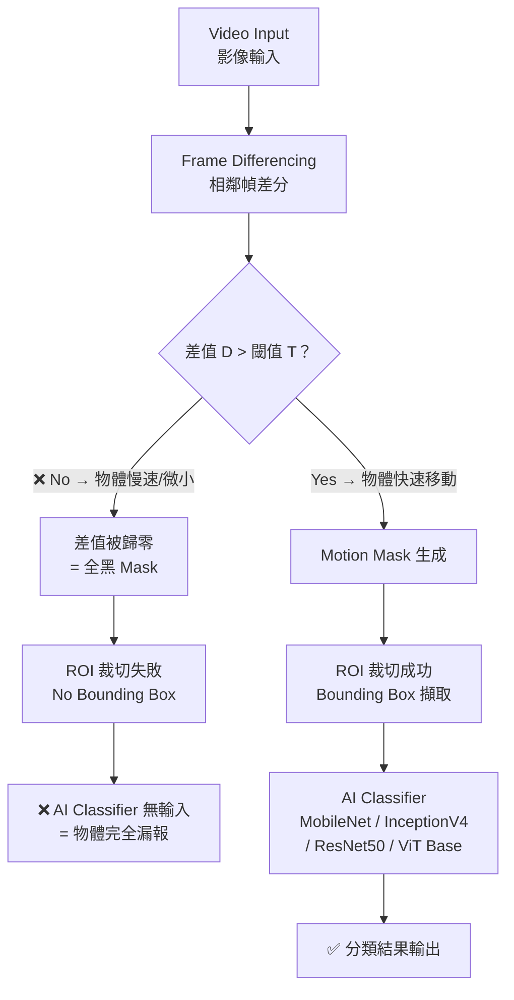

# Limitation_02 深度解析
## 基於 Pro's Article：*Energy-Efficient Fast Object Detection on Edge Devices for IoT Systems*

---

> [!IMPORTANT]
> 這份分析針對你研究的核心痛點：**Frame Differencing 方法對「小型物體」或「慢速移動物體」的偵測失效問題**。

---

## 一、原文引用（Limitation_02 原文）

論文第 IV 節（Conclusion 前的討論段落，見文章截圖）：

> *"Frame differencing has difficulty detecting motion in certain scenarios, such as **small or slow objects**. When objects move **very slowly**, the difference in pixel intensity between consecutive frames may be **too subtle to pass the detection threshold**, causing the method to **miss these objects altogether**. And very fast-moving objects until motion blur occurs. This blurring reduces the contrast and clarity of object edges, making it difficult for the frame differencing method to effectively identify and quantify changes."*

---

## 二、問題本質：為什麼 Frame Differencing 會在這裡失效？

### 2.1 Frame Differencing 的工作原理（先建立基礎）

Frame Differencing 的核心運算是：

$$D(x, y) = |I_t(x, y) - I_{t-1}(x, y)|$$

其中：
- $I_t(x, y)$ = 當前幀在像素點 $(x,y)$ 的強度值
- $I_{t-1}(x, y)$ = 前一幀在像素點 $(x,y)$ 的強度值
- $D(x, y)$ = 差值圖（Difference Image）

接著進行**二值化（Thresholding）**：

$$B(x, y) = \begin{cases} 255 & \text{if } D(x,y) > T \\ 0 & \text{if } D(x,y) \leq T \end{cases}$$

其中 $T$ 是預先設定的**偵測門檻值（Detection Threshold）**。

這個 $T$ 是 Limitation_02 問題的關鍵所在。

---

### 2.2 Limitation_02 的核心機制拆解

#### **情境 A：物體移動速度極慢（Very Slow Moving Objects）**

```
Frame t-1:    [背景] [物體在位置 X]    [背景]
Frame t:      [背景] [物體在位置 X+ε]  [背景]
                              ↑
                       ε → 極小位移
```

**問題鏈（Cause Chain）：**

| 步驟 | 發生了什麼 | 後果 |
|------|-----------|------|
| ① 物體緩慢移動 | 相鄰幀之間的像素位移 `ε` 極小 | 差值圖 $D(x,y)$ 數值很小 |
| ② 差值過小 | $D(x,y) \leq T$，無法超過偵測門檻 | 整個像素點被歸零（判定為背景） |
| ③ 二值化後全黑 | 差值圖沒有白色區域（Motion Mask 為空） | ROI 裁切演算法找不到任何 bounding box |
| ④ 沒有 ROI | AI Classifier 沒有任何輸入圖像 | 物體**完全被忽略（Miss Altogether）** |

> [!CAUTION]
> 這不是「誤判」（False Positive），而是「完全漏報」（False Negative / Miss Detection）——物體就在畫面中，但系統完全感知不到它的存在。

#### **情境 B：物體尺寸極小（Very Small Objects）**

即使物體移動速度正常，若物體尺寸極小：

```
整個畫面解析度：1920 × 1080 像素
小型物體佔據：僅 10 × 10 = 100 個像素點
```

**問題鏈：**

| 步驟 | 發生了什麼 |
|------|-----------|
| ① 物體像素佔比極低 | 差值圖中只有 100 個左右的像素點有差值 |
| ② 圖像模糊（Blurring）後 | 這 100 個點被低通濾波器「平滑」掉 |
| ③ 訊號被噪聲淹沒 | 小物體的差值訊號 ≈ 背景噪聲等級 |
| ④ 無法超過閾值 | 同上，ROI 擷取失敗 |

---

### 2.3 此問題對論文提出方法的系統性影響



> [!NOTE]
> 論文中的系統架構是 **「Frame Differencing → AI Classifier」的串聯管線（Pipeline）**。如果第一階段（Frame Differencing）就漏報了，AI Classifier 根本沒有機會運作——Pipeline 的第一關失守，後續所有精確度都無從發揮。

---

## 三、論文實驗結果中的佐證

論文在 Abstract 和 Conclusion 中明確指出：

> *"Of all these classes, the faster objects are trains and airplanes. Experiments show that the accuracy percentage for trains and airplanes is lower than other categories."*

以及（另一端的反向佐證）：

> *"And very fast-moving objects until motion blur occurs. This blurring reduces the contrast and clarity of object edges..."*

這說明論文的閾值設定面臨**兩難困境（Threshold Dilemma）**：

```
閾值 T 太低 → 慢速物體可被偵測，但噪聲（背景樹搖動、鏡頭震動）大量誤報 → Limitation_01 加劇
閾值 T 太高 → 噪聲被有效過濾，但慢速/小型物體訊號也被一起過濾 → Limitation_02 發生
```

**這是一個根本性的矛盾（Fundamental Trade-off）**，單靠固定閾值無法同時解決。

---

## 四、為什麼這是你研究的「核心痛點」

### 4.1 論文的目標族群是「Fast-Moving Objects」

論文題目：**"Energy-Efficient **Fast** Object Detection..."**

論文的核心設計前提是物體必須「夠快」，才能在相鄰幀之間產生足夠的差值去觸發偵測。

**但這個前提在真實世界中並不總是成立：**

| 應用場景 | 可能存在的慢速/小型物體 |
|---------|----------------------|
| 監控（Surveillance） | 緩慢潛行的入侵者、遠距離的可疑人員 |
| 自動駕駛（ADAS） | 緩慢切換車道的車輛、靜止後緩慢啟動的行人 |
| 人體活動辨識（HAR） | 細微肢體動作（如手勢識別） |
| IoT 邊緣部署 | 環境中的慢速移動物件（如工廠中緩慢移動的機械臂） |

### 4.2 方法的精確度隱含「選擇性偏差」

論文的高精確度結果是建立在「物體夠快才能被第一階段偵測到」的隱含篩選條件下。換句話說：

> **論文的精確度只衡量「被偵測到的物體」的分類準確率，而不包含「被完全漏報的物體」。**

這使得整體的 **Recall（召回率）** 指標可能被嚴重低估，但論文並未明確測量這一點。

---

## 五、問題形式化（Formal Problem Statement）

設：
- $v$ = 物體移動速度（pixels/frame）
- $s$ = 物體尺寸（pixels²）
- $T$ = 偵測閾值
- $\sigma_n$ = 背景噪聲標準差

**Limitation_02 的失效條件：**

$$\Delta I_{motion}(v, s) \leq T$$

其中 $\Delta I_{motion}$ 是物體運動在差值圖中產生的最大強度變化，且：

$$\Delta I_{motion} \propto v \cdot s \cdot \text{contrast}$$

當 $v \to 0$（慢速）**或** $s \to 0$（微小），$\Delta I_{motion}$ 下降，直到 **低於閾值 $T$**，系統失效。

---

## 六、針對 Limitation_02 的潛在研究方向

> [!TIP]
> 以下是可能的突破方向，可作為你研究的切入點：

| 方向 | 核心思路 | 潛在優點 |
|------|---------|---------|
| **自適應閾值（Adaptive Threshold）** | 根據場景動態調整 $T$，而非固定值 | 在靜態背景下降低 $T$ 以偵測慢速物體 |
| **時序累積差分（Temporal Accumulation）** | 不只比較相鄰兩幀，而是累積多幀差分 | 慢速物體在 $N$ 幀後仍可積累出足夠差值 |
| **光流輔助（Optical Flow Guided）** | 在 Frame Differencing 失效時切換到稀疏光流 | 可偵測亞像素級位移 |
| **超解析度前處理（Super Resolution Pre-processing）** | 放大小型物體後再做差分 | 小物體的像素數量放大，訊號增強 |
| **多尺度差分（Multi-scale Differencing）** | 在不同解析度的金字塔上分別做差分 | 不同尺度捕捉不同速度和大小的物體 |
| **背景建模（Background Subtraction Model）** | 建立動態背景模型（如 GMM / MOG2）取代純幀差 | 對慢速物體有更強的偵測能力 |

---

## 七、總結：Limitation_02 的問題本質

```
根本原因：Frame Differencing 的本質是「差值訊號」偵測
核心矛盾：慢速/小型物體的差值訊號 ≤ 背景噪聲 + 固定閾值
系統後果：Pipeline 第一關漏報 → AI Classifier 無從補救 → 整體 Recall 下降
研究價值：論文只解決了 Fast-Moving Object Detection，但 Slow/Small Object Detection 仍是開放問題
```

這個問題的核心在於 **「偵測觸發機制的盲區（Detection Blind Spot）」**——不是 AI 分錯了，而是 AI 根本沒有機會看到目標物體。

---

*基於文章：Achmadiah et al., "Energy-Efficient Fast Object Detection on Edge Devices for IoT Systems," IEEE Internet of Things Journal (arXiv:2602.09515v1, Feb 2026)*
