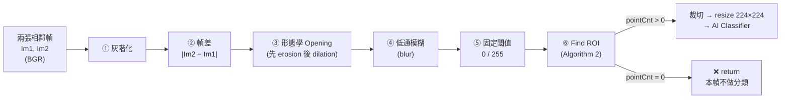

# Limitation 分析：Frame Differencing 對慢速物體的漏報問題

## 基於 Pro's Article：*Energy-Efficient Fast Object Detection on Edge Devices for IoT Systems*

*Achmadiah, Ahamad, Sun, Kuo — IEEE Internet of Things Journal（arXiv:2602.09515v1, Feb 2026）*

---

> [!IMPORTANT]
> **範圍聲明**：本文只處理原文 Limitation 中的「**慢速物體（slow objects）**」問題。同一段落提到的「小型物體」與「高速物體的動態模糊（motion blur）」不在本文範圍內，只在與慢速問題耦合時順帶提及。
>
> **目的**：為 [Experiment Design.md](Experiment%20Design.md) 中的 ATS-FD 加速器提供 (1) 失效機制的逐級拆解、(2) 可量化的偵測條件、(3) 解決方案的設計空間，以及 (4) 對現有實驗設計的檢查結果。

---

## 一、原文定位

### 1.1 原文

位於論文 **Section IV（Experimental Result）結尾**、Conclusion 之前。作者在此段解釋「為何本方法無法達到最高準確率」：

> *"Frame differencing has difficulty detecting motion in certain scenarios, such as small or slow objects. When objects move very slowly, the difference in pixel intensity between consecutive frames may be too subtle to pass the detection threshold, causing the method to miss these objects altogether."*

### 1.2 這段話的三個關鍵詞

| 原文用詞 | 技術意涵 |
|---|---|
| *between consecutive frames* | 時間基線固定為 **1 幀**（stride = 1），這是問題的根源 |
| *pass the detection threshold* | 使用**固定**的二值化閾值 $T$ |
| *miss these objects altogether* | 失效模式是**漏報（False Negative）**，不是誤分類 |

> [!NOTE]
> 作者只提出了這個限制，**沒有量化它**（沒有給出多慢算「慢」），也**沒有在實驗中測試**慢速場景。這正是可以切入的研究缺口。

---

## 二、還原論文的偵測管線

要分析慢速物體為何失效，必須先精確知道論文的第一階段做了哪些運算。根據 Section III-A、Algorithm 1、Algorithm 2 與 Fig. 1–6，Movement Detection 依序為：



| 階段 | 論文描述 | 論文是否公開參數 |
|---|---|---|
| ① 灰階化 | 3-channel → grayscale | — |
| ② 幀差 | 只比較**兩張連續幀**（Algorithm 1） | stride 固定為 1 |
| ③ Opening | 用於去除「草地輕微晃動」等背景噪聲 | ❌ structuring element 大小未公開 |
| ④ Blur | 與低通濾波核做卷積 | ❌ kernel 大小未公開 |
| ⑤ Threshold | 小於閾值為 0，否則為 255 | ❌ 閾值未公開 |
| ⑥ Find ROI | 找所有前景點，取 $X_{min}, X_{max}, Y_{min}, Y_{max}$，**單一全域 bounding box** | — |

> [!NOTE]
> 論文在 Related Work 明確把「只處理兩張連續幀、不維護背景模型」當作 frame differencing 比 background subtraction **更省能**的理由。也就是說，**造成慢速漏報的設計選擇，正是論文能耗優勢的來源**。任何解法都必須面對這個取捨：加入多少時間記憶，要付出多少記憶體與能耗。
>
> （附註：Algorithm 1 第 7 行寫成 `Im1 ← vFrame`，依上下文應為 `Im2 ← vFrame`，屬排版錯誤，不影響本分析。）

---

## 三、失效機制：逐級拆解

慢速物體不是只在「閾值」那一關失敗。**管線中的每一級都在削弱慢速物體的訊號**，閾值只是最後一刀。

### 3.1 第 ② 級：幀差只留下「邊緣細條」

設一個亮度均勻、與背景對比為 $C$ 的物體，以每幀 $v$ 像素的速度水平移動。相鄰兩幀相減後：

```
Frame t-1:   ░░░░░████████████░░░░░░
Frame t:     ░░░░░░░████████████░░░░
                                          （v = 2 px/frame）
|差值|:       ·····██··········██·····
                  ↑ 尾緣       ↑ 前緣
                  寬度 = v     寬度 = v
```

- **物體內部互相抵消**：亮度均勻的區域在兩幀中都是物體，差值為 0。
- **只剩前緣與尾緣兩條細帶**，寬度 $w = v$（像素）。
- **當 $v < 1$（次像素移動）**：邊緣像素只被部分覆蓋，差值振幅降為約 $C \cdot v$，寬度只剩 1 像素。

**結論**：慢速物體在差值圖中的訊號，**寬度**和（次像素時的）**振幅**都隨 $v$ 線性縮小。

### 3.2 第 ③ 級：Opening 是一個「厚度濾波器」

這是原文沒有提到、但對慢速物體**最致命**的一級。

形態學 Opening（先 erosion 再 dilation，structuring element 大小為 $s \times s$）的數學性質是：**任何寬度小於 $s$ 的前景結構都會被完全移除**，且無法由後續的 dilation 復原。

```
Opening 前（v = 2，邊緣寬 2 px）：  ·····██··········██·····
Erosion（s = 3）：                  ························   ← 全部消失
Dilation：                          ························   ← 無從復原
```

論文用 Opening 來去除「草地輕微晃動」造成的細碎噪聲——但**慢速物體的邊緣細帶，在形態上和這些噪聲無法區分**。只要 $v < s$，物體在這一級就被當成噪聲刪除了，**根本輪不到閾值判斷**。

### 3.3 第 ④ 級：Blur 進一步稀釋振幅

即使細帶通過了 Opening，大小為 $b$ 的低通模糊核會把寬度 $w$ 的細帶與周圍的 0 平均，峰值振幅降為約：

$$C_{\text{blur}} \approx C \cdot \frac{\min(w,\, b)}{b}$$

細帶越窄（物體越慢），被稀釋得越嚴重。

### 3.4 第 ⑤ 級：固定閾值

最後，$C_{\text{blur}}$ 必須超過固定閾值 $T$ 才能成為前景。$T$ 不能任意調低，因為原文同一段的前一個 Limitation 指出 frame differencing 對樹葉、水流、光照變化、鏡頭震動都很敏感——**調低 $T$ 會直接放大 False Positive**。

### 3.5 第 ⑥ 級之後：漏報無法被下游補救

當二值圖全黑，Algorithm 2 的 `pointCnt = 0`，直接 `return`，**這一幀不產生任何 ROI，AI Classifier 不會被呼叫**。不論下游用 MobileNet 還是 ViT，分類器再強都無法補救第一階段的漏報。

### 3.6 小結

| 級 | 對慢速物體的影響 | 失效條件（近似） |
|---|---|---|
| ② 幀差 | 訊號只剩寬度 $v$ 的邊緣細帶；$v<1$ 時振幅降為 $Cv$ | — |
| ③ Opening | 寬度 $< s$ 的細帶被整條刪除 | $v < s$ |
| ④ Blur | 振幅被稀釋為 $C \cdot \min(v,b)/b$ | — |
| ⑤ Threshold | 稀釋後振幅不夠高 | $C \cdot \min(v,b)/b \le T$ |
| ⑥ ROI | 無前景點 → 不分類 | 上述任一成立 |

---

## 四、量化模型：多慢算「慢」？

### 4.1 臨界速度

把第三節的條件合併，並推廣到時間基線為 $N$ 幀（即比較 $I_t$ 與 $I_{t-N}$，邊緣細帶寬度變為 $vN$）：

$$\boxed{\;v \cdot N \;\ge\; w_{\min} \;=\; \max\!\left(s,\; \frac{b\,T}{C}\right)\;}$$

其中：

| 符號 | 意義 |
|---|---|
| $v$ | 物體在影像上的視速度（pixels/frame） |
| $N$ | 時間基線（論文中 $N = 1$） |
| $s$ | Opening 的 structuring element 大小 |
| $b$ | Blur kernel 大小 |
| $T$ | 二值化閾值 |
| $C$ | 物體與背景的亮度對比 |
| $w_{\min}$ | 能存活通過整條管線所需的最小邊緣寬度 |

因此臨界速度為：

$$v_{\text{crit}}(N) = \frac{w_{\min}}{N}$$

**論文的方法（$N=1$）只能偵測 $v \ge w_{\min}$ 的物體；把時間基線拉長到 $N$，可偵測的最低速度就降低 $N$ 倍。** 這是後續所有解法的數學基礎。

### 4.2 速度的單位換算：「慢」取決於 fps 與解析度

$$v\;[\text{px/frame}] = \frac{\text{物體實際角速度} \times \text{每單位角度的像素數}}{\text{fps}}$$

這帶出兩個反直覺的結論：

1. **fps 越高，物體在每幀的位移越小，越容易漏報。** 從 30 fps 升到 60 fps，同一物體的 $v$ 減半。
2. **遠處物體即使實際速度很快，在影像上也可能是「慢速」。** 例如高空飛機的實際速度很快，但視速度可能只有每幀零點幾個像素。

### 4.3 數值範例（僅作示意）

> [!WARNING]
> 論文未公開 $s$、$b$、$T$，以下參數為**假設值**，只用來說明量級。實驗中需要以實際參數重新量測。

假設 $s = 3$、$b = 5$、$T/C = 0.5$，則 $w_{\min} = \max(3,\; 2.5) = 3$ px：

| 時間基線 $N$ | $v_{\text{crit}}$ (px/frame) | @30 fps (px/s) | 橫越 3840 px 寬的畫面所需時間 |
|---|---|---|---|
| 1（論文） | 3.0 | 90 | 約 43 秒 |
| 8 | 0.375 | 11.25 | 約 5.7 分鐘 |
| 30 | 0.1 | 3 | 約 21 分鐘 |
| 120 | 0.025 | 0.75 | 約 85 分鐘 |

在這組假設下，**論文的方法在 4K / 30 fps 下，任何需要超過約 43 秒才走完畫面寬度的物體都看不見**。在監控場景中，緩慢走動的遠處行人很容易落在這個範圍內。

### 4.4 代價：偵測延遲

拉長時間基線不是免費的。以凍結的參考幀來看，物體開始移動後，邊緣寬度隨時間增長為 $v \cdot \Delta t$，需要等到：

$$\Delta t_{\text{detect}} = \frac{w_{\min}}{v} \;\text{frames}$$

才會被偵測到。例：$v = 0.1$ px/frame、$w_{\min} = 3$ → 需 30 幀（30 fps 下 1 秒）。**越慢的物體需要越久才能被偵測**，這是物理限制，任何方法都無法繞過，只能取捨。因此「偵測延遲」必須列為實驗指標。

---

## 五、論文實驗的評估盲點

### 5.1 測試類別本身就偏向快速物體

論文的四個類別為 bird、car、train、airplane，作者並在 Conclusion 中明確指出「the fastest objects are trains and airplanes」。**沒有任何一個類別或測試影片是針對慢速物體設計的**，因此論文的數據無法反映這個 Limitation 的嚴重程度。

### 5.2 準確率指標無法反映漏報

論文報告的指標為 Acc(%)、Latency、Energy、Efficiency，**沒有 Recall、Miss Rate 或 per-frame 偵測率**。論文也未說明 Acc 的分母是否包含「第一階段沒觸發、從未送進分類器」的幀。若不包含，則漏報完全不會反映在 Acc 上。

> [!CAUTION]
> 這代表：**論文的數據既無法證明、也無法否定**本方法在慢速場景下的表現。你的實驗必須自行建立能量測漏報的指標與資料集（見第八節）。

### 5.3 參數未公開

$s$、$b$、$T$ 都未公開，因此無法從論文直接算出臨界速度。復現時需要自行決定並記錄這些參數，並以第四節的模型說明它們如何影響 $v_{\text{crit}}$。

---

## 六、解決方案的設計空間

從第四節的不等式 $v \cdot N \ge \max(s,\; bT/C)$ 可以看出，解法只有三類槓桿：**拉長時間基線 $N$**、**降低管線需要的最小寬度（$s$、$b$）**、**提高有效訊雜比（$C/T$）**。

| 方向 | 作用的槓桿 | 對慢速物體的效果 | 硬體/能耗代價 | 備註 |
|---|---|---|---|---|
| **固定步長參考幀**（比較 $I_t$ 與 $I_{t-N}$） | $N$ ↑ | 直接把 $v_{\text{crit}}$ 降低 $N$ 倍 | 一張參考幀的記憶體 | 最直接；但固定 $N$ 對快速物體會產生拖影 |
| **自適應步長**（依場景切換 $N$） | $N$ ↑（按需） | 同上，且保留快速物體的反應性 | 參考幀 + 控制邏輯 | 即 ATS-FSM 的思路 |
| **時域累積 / 漏失積分** | 有效 $C/T$ ↑、持續性 ↑ | 讓弱訊號跨幀累積；讓偵測結果持續存在 | 一張能量圖 | 單獨對 stride-1 差值積分效果有限（見 6.1） |
| **自適應 / 噪聲感知閾值** | $T$ ↓（在安靜區域） | 在背景穩定處降低門檻 | 需估計局部噪聲 | 不改變 $v<s$ 時被 Opening 刪除的問題 |
| **縮小或取消 Opening / Blur** | $s$、$b$ ↓ | 降低 $w_{\min}$ | 幾乎免費 | 但會讓 Limitation_01（背景噪聲）惡化，需要其他去噪手段替代 |
| **背景建模**（running average、GMM/MOG2） | 等效 $N \to$ 很大 | 對慢速物體很有效 | 每像素需多組統計量，記憶體與運算量大 | 論文明確以「能耗較高」排除此類方法 |
| **光流**（LK、HS） | 次像素位移估計 | 理論上可偵測次像素運動 | 運算量大 | 論文 Introduction 已指出其計算複雜且易出錯 |

### 6.1 為什麼「參考幀拉長基線」比「把相鄰幀差值加總」好

直覺上，把 $N$ 張相鄰幀的差值 $|I_t - I_{t-1}|$ 加總，似乎等同於拉長基線。但兩者的訊雜比差很多：

設每幀感測器噪聲標準差為 $\sigma$，則單次幀差的噪聲標準差為 $\sqrt{2}\sigma$。

- **參考幀法** $|I_t - I_{t-N}|$：訊號為 $C$（邊緣已移出 $vN$ 像素），噪聲**仍只有一次相減**的 $\sqrt{2}\sigma$。
- **相鄰幀差值加總** $\sum |I_k - I_{k-1}|$：在單一像素上，訊號總和最多為 $C$；但取絕對值後噪聲**每幀都貢獻一個正的平均值**（約 $1.13\sigma$），$N$ 幀後累積出約 $1.13N\sigma$ 的噪聲地板。

**結論**：要偵測慢速物體，**拉長時間基線（參考幀）是主要手段**；時域積分適合用在參考幀差值之上，提供「持續性」與「平滑」，而不是取代它。這也是 ATS-FD 先做 stride 再做 leaky integration 的合理性所在。

### 6.2 參考幀法的副作用：鬼影（Ghosting）

參考幀凍結期間，物體在參考幀中的「舊位置」也會產生差值。當 $vN$ 大於物體長度時，差值圖會出現兩塊分離的區域（舊位置與新位置），ROI 會把兩者一起框起來，裁切結果包含大量背景。此外，原本靜止、後來離開的物體，會在參考幀更新前於原位留下鬼影。這是選擇最大 $N$ 時必須考慮的上限。

---

## 七、對 Experiment Design（ATS-FD）的銜接與檢查

ATS-FD 的三個模組正好對應第六節的前三個方向：

| ATS-FD 模組 | 對應的槓桿 | 解決的失效級 |
|---|---|---|
| ATS-FSM v2（多級 stride） | 時間基線 $N$ | ②③④⑤ 全部（邊緣寬度從 $v$ 變為 $vN$） |
| TLI-PE v2（漏失積分 + 噪聲地板） | 持續性、有效訊雜比 | ⑤ |
| Smart ROI v2（持續性濾波 + 多 ROI） | 抑制短暫誤報、改善多物體裁切 | ⑥ |

整體方向與本分析的結論一致。以下是依據本分析檢查 [Experiment Design.md](Experiment%20Design.md) 後發現、**建議在實驗前修正或驗證**的四個問題。

### 7.1 ⚠️ 漏失積分公式的衰減方向相反

Experiment Design 中的更新式為：

$$E_{\text{new}} = (E_{\text{old}} \gg k) + \Delta P - N_f$$

$E_{\text{old}} \gg k$ 只**保留** $E_{\text{old}}$ 的 $2^{-k}$。$k = 7$ 時只保留 1/128，等於**幾乎完全遺忘**，與表格中「$k=7$ → 極慢衰減」的意圖相反。在穩態下 $E \approx \Delta P$，**沒有任何累積效果**。

正確的漏失積分器應為：

$$E_{\text{new}} = E_{\text{old}} - (E_{\text{old}} \gg k) + \Delta P - N_f$$

此時：

- 每幀衰減 $2^{-k}$，時間常數約 $2^k$ 幀（$k=7$ → 約 128 幀）。
- 穩態增益為 $2^k$：$E_{\text{steady}} \approx (\Delta P - N_f) \cdot 2^k$。
- $\Delta P \le 255$、$k = 7$ 時，$E_{\max} \approx 255 \times 128 = 32640 < 65535$，**16-bit 能量路徑剛好足夠**，這反而印證了改為 16-bit 的必要性。
- 硬體只多一個減法器，可併入 Stage 3。

同時要注意：增益 $2^k$ 也會放大 $N_f$ 的估計誤差。若 $N_f$ 低估了 $\delta$，靜態區域會累積出 $\delta \cdot 2^k$ 的偏差，因此 $T_{\text{pixel}}$ 必須隨 $k$ 一起調整。

### 7.2 ⚠️ ATS-FSM 可能出現極限環震盪

FSM 依據活動量 $A_{\text{frame}}$ 切換檔位，但 **$A_{\text{frame}}$ 本身取決於目前的 stride**：

1. 慢速物體在 `FAST`（$N=1$）下不可見 → $A_{\text{frame}}$ 低 → 降檔。
2. 到 `SLOW`（$N=30$）後物體變得可見 → $A_{\text{frame}}$ 升高 → 若超過 $T_{\text{up}}$ 就**立即升檔**。
3. 回到 `NORMAL` 後物體又不可見 → 經過 $M$ 幀後再次降檔 → 回到步驟 2。

遲滯（hysteresis）只能抑制閾值附近的噪聲抖動，**無法消除這種由回授造成的週期性震盪**。建議方向：

- 讓升檔判斷使用與 stride 無關的指標，例如把 $A_{\text{frame}}$ 除以當前 $S_k$ 正規化，或另外監測「全畫面大面積劇變」作為升檔條件。
- 或改為「偵測到持續 ROI 時鎖定當前檔位」，直到 ROI 消失才允許換檔。
- **必須用模擬驗證**：設計一個以固定慢速移動的測試序列，觀察 FSM 狀態是否收斂。

### 7.3 ⚠️ ZCU104 的片上記憶體容量需要重新核對

Experiment Design 寫的是「11MB URAM + 3.5MB BRAM = 14.5MB」。但 ZCU104 上的 XCZU7EV，規格書中的單位應為 **Mb（megabit）**：約 11 Mb BRAM + 27 Mb URAM ≈ 38 Mb ≈ **4.75 MB**。（請以 AMD/Xilinx DS891 核對。）

| 配置 | 參考幀 | 能量圖 | 合計 | 是否放得下 ~4.75 MB |
|---|---|---|---|---|
| 1080p，8-bit 能量 | 2.07 MB | 2.07 MB | 4.15 MB | 勉強，幾乎沒有餘裕給其他模組 |
| 1080p，16-bit 能量 | 2.07 MB | 4.15 MB | 6.22 MB | ❌ 放不下 |
| 960×540（2×2 降採樣），16-bit 能量 | 0.52 MB | 1.04 MB | 1.56 MB | ✅ |

若容量確實不足，可考慮在偵測路徑上做 2×2 降採樣：

- **好處**：2×2 平均可把噪聲 $\sigma$ 減半，提高 $C/T$。
- **代價**：以原始解析度計算，$v$ 在降採樣影像中也減半，等效 $w_{\min}$ 變為兩倍。但這可由 stride $N$ 補回來，對慢速物體的偵測影響有限。
- ROI 座標乘以 2 映射回原圖，再交給分類器裁切全解析度影像。

### 7.4 下游的 Opening / Blur 是否保留需要明確定義

Experiment Design 的管線中沒有提到論文的 Opening 與 Blur。若保留它們，$s$ 與 $b$ 仍決定 $w_{\min}$（第四節）；若移除，則需要由 TLI-PE 的噪聲地板扣除與 ROI 持續性濾波來承擔原本的去噪工作。**這是一個需要在實驗中消融比較的設計選擇**，不應默認。

---

## 八、建議的實驗設計要點

### 8.1 自變數

| 變數 | 範圍建議 | 目的 |
|---|---|---|
| 物體視速度 $v$ | 0.01 – 5 px/frame（對數刻度） | 量出偵測率 vs. 速度曲線與 $v_{\text{crit}}$ |
| 對比 $C$ | 低 / 中 / 高 | 驗證 $w_{\min}$ 中 $bT/C$ 項的影響 |
| 時間基線 / FSM 檔位 | $N \in \{1, 8, 30, 120\}$ 與自適應 | 驗證 $v_{\text{crit}} \propto 1/N$ |
| fps | 30 / 60 | 驗證 4.2 節「fps 越高越難偵測」 |
| 背景噪聲 | 靜態 / 動態背景（樹葉、光照） | 量測解法對 False Positive 的代價 |

### 8.2 因變數（評估指標）

| 指標 | 為什麼需要 |
|---|---|
| **偵測率 / Recall（per-object 與 per-frame）** | 論文沒有，但這是 Limitation 的直接量測 |
| **臨界速度 $v_{\text{crit}}$**（偵測率達 50% 或 90% 時的速度） | 把「慢」量化成單一可比較的數字 |
| **偵測延遲 $\Delta t_{\text{detect}}$** | 拉長基線的必然代價（4.4 節） |
| **False Positive 率** | 確認沒有用 Limitation_01 換取 Limitation_02 的改善 |
| **分類器喚醒次數與能耗** | 延續論文的能耗主張，證明改進沒有破壞能效優勢 |
| **FPGA 資源使用率（BRAM/URAM/LUT）** | 驗證 7.3 節的容量問題 |

### 8.3 資料集

- **合成資料（主要）**：在真實背景影片上貼入以精確速度 $v$ 移動的物體，才能畫出偵測率 vs. 速度曲線，並得到 ground truth。
- **真實資料（輔助）**：CDnet 2014 中的 *intermittentObjectMotion*、*lowFramerate*、*dynamicBackground* 等類別，可分別測試慢速/間歇運動與背景噪聲下的表現。
- **基線比較**：論文原方法（$N=1$ + Opening + Blur + 固定 $T$）、固定 stride 參考幀、running-average 背景減除、ATS-FD。

---

## 九、總結

```
根本原因：時間基線固定為 1 幀，慢速物體在差值圖中只剩寬度約為 v 的邊緣細帶
放大因素：Opening 會刪除寬度 < s 的細帶；Blur 會稀釋其振幅；固定閾值 T 無法下調
偵測條件：v · N ≥ max(s, b·T/C)  →  v_crit = w_min / N
系統後果：ROI 為空 → 分類器從未被呼叫 → 漏報，且論文的 Acc 指標無法反映
評估缺口：論文沒有慢速測試類別、沒有 Recall 指標、沒有公開 s / b / T
解決主軸：拉長時間基線（參考幀 stride），時域積分作為輔助，並量測偵測延遲作為代價
實驗前待修：漏失積分公式方向、FSM 極限環、ZCU104 記憶體容量、Opening/Blur 去留
```

這個問題的本質是**偵測觸發機制的時間盲區**：不是分類器分錯了，而是在只看兩張連續幀的時間尺度下，慢速物體的運動在物理上根本還沒產生足夠的可觀測變化。
