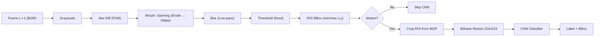

# 實驗架構設計 v0.2（刪除 ATBS、對齊教授論文、收斂為可投稿規模）

> 更新：2026-10-04　｜　前版：v0.1（6 組實驗雛形 + 審查風險過濾）
> 參考：[Pro's Article.pdf](./Pro's%20Article.pdf)（Achmadiah, …, C.-C. Sun, *Energy-Efficient Fast Object Detection on Edge Devices for IoT Systems*, IEEE IoT-J / arXiv 2602.09515）、[Research_Outline.md](./Research_Outline.md)

---

## 0. 決策摘要

| 項目 | v0.1 | **v0.2 決定** | 理由 |
|---|---|---|---|
| 前處理 | ATBS + FDM | **只用 FDM**（教授原版流程，閾值做成 runtime 可調暫存器） | 教授論文本身就是**固定閾值**的 FDM，沒有用 ATBS；刪掉後可聚焦 DSA |
| 偵測方式 | 「MobileNetV2 / ResNet 物件偵測」（偵測頭未定） | **FDM 負責定位（ROI）＋ CNN 負責分類，不需要偵測頭** | 與教授論文完全一致；CNN 輸入固定，最適合做硬體 |
| CNN 輸入 | 未定 | **224×224×3** | 與教授論文相同（ImageNet 標準） |
| 影片輸入 | 未定（教授用 4K） | **1280×720（主實驗）**；1080p 只在 ZCU104 上做延伸 | PYNQ-Z2 的 DDR3 / BRAM 吃不下 4K；720p 雙板都可行 |
| 輕量模型 | MobileNetV2 | **MobileNetV1** | 直接維持教授版本，使用 Transfer Learning (Feature Extraction) |
| 重量模型 | ResNet（未定） | **ResNet18**；剪枝 ResNet50 移到 Future Work | 見 §3 |
| 分類頭 | 未定 | **4 類 + 1 個「背景」類**（bird / train / airplane / car / background） | 沿用教授的類別；背景類用來吸收 FDM 誤報，取代 ATBS 的功能 |
| 精度指標 | mAP | **Top-1 Accuracy**（FP32 基準 vs. 部署精度） | 沒有偵測頭，mAP 不適用；與教授的 Acc% 一致 |
| 實驗數 | 6 組 | **6 組主實驗 + 1 組健全性檢查** | 完整驗證跨平台極限與單晶片內不同配置（配置 A/B/C⁻/C）的效益 |
| 投稿 | 三個會議並列 | **GLSVLSI (首選目標)** | 三個截稿日相近，同一篇不能一稿多投，見 §6 |

---

## 1. 從教授論文擷取的基準

### 1.1 教授的流程（本研究的演算法基準）

| 教授論文設定 | 內容 |
|---|---|
| 模型 | MobileNet（圖 7 為 DW+PW+BN+ReLU，即 V1 架構）、ResNet50、Inception-v4、ViT-Base；對照組：YOLOX（end-to-end） |
| 類別 / 資料 | bird、train、airplane、car；ImageNet 預訓練；4K 測試影片（3840×2160 / 4096×2016） |
| 平台 | AMD Alveo U50、Jetson Orin Nano、Hailo-8（FDM 在 Host x86 上跑） |
| 指標 | Acc (%)、Latency (ms)、Energy (J)、Efficiency (%/ms·W) |
| 功耗量測 | PowerTOP / jtop（軟體估算） |
| 自述限制 | FDM 對動態背景、相機抖動敏感 → 誤報；慢速或小物件會漏偵；高速物件有動態模糊 |

### 1.2 本研究的定位：繼承什麼、改進什麼

| 面向 | 教授論文 | 本研究 |
|---|---|---|
| 演算法 | FDM + CNN 分類 | **完全繼承**（不改演算法） |
| FDM 執行位置 | Host CPU（x86 / ARM） | **PL 硬體串流引擎，與 CNN 融合** ← 核心貢獻 |
| 研究層次 | 應用 / 平台評比 | **計算機架構**（記憶體階層、資料搬移、Roofline） |
| 功耗量測 | 軟體工具 | **硬體電源軌量測**（INA226 / INA3221 / 外接功率計）← 方法論加分 |
| 平台 | 通用加速器 | 另加入**客製化 DSA（雙記憶體模式）** |

> [!TIP]
> 在論文中可以把教授論文當成「演算法已被驗證有效」的前提，所以本研究不需要再證明 FDM+CNN 的準確度優勢，只要證明**硬體能把它跑得更省能**。這讓大學生專題的範圍自然收斂。

---

## 2. 偵測頭與解析度建議

### 2.1 為什麼不用偵測頭（SSD / RetinaNet / YOLO）

1. **教授的方法本身就不需要偵測頭**：定位由 FDM 的 ROI 完成，CNN 只做分類。加偵測頭反而偏離基準。
2. **硬體負載固定**：CNN 輸入固定 224×224，每次推論的 MAC 數、記憶體佔用都是常數，DSA 可以做靜態排程（不需要動態 anchor / NMS 硬體）。
3. **省掉大量工程**：NMS、anchor decode、多尺度 FPN 都不必做，工程量至少減一半。
4. **容量問題直接消失**：v0.1 的風險 A4（ZCU104 放不下 SSDLite）在分類模式下可解，見 §3.3。

### 2.2 解析度與頻寬估算

| 輸入 | 灰階幀（FDM 前一幀） | BGR 幀 | 4K 可行性 |
|---|---|---|---|
| 640×480 | 0.31 MB | 0.92 MB | — |
| **1280×720（主）** | **0.92 MB** | **2.76 MB** | — |
| 1920×1080（ZCU104 延伸） | 2.07 MB | 6.22 MB | — |
| 3840×2160（教授原設定） | 8.29 MB | 24.9 MB | PYNQ-Z2 不建議 |

- **FDM 前一幀放哪裡**可以做成組態參數：
  - ZCU104：720p / 1080p 灰階幀可以放進 URAM（3.375 MB）→ FDM 零 DDR 存取。
  - PYNQ-Z2：放不下 → 前一幀留在 DDR；或用 1/2 降採樣做 FDM（640×360 = 0.23 MB 可放進 BRAM）。
- **形態學、模糊、閾值**都只需要 line buffer（幾行 × 1280 B ≈ 10 KB），完全適合串流。

> [!IMPORTANT]
> **ROI 要等整幀處理完才知道**（bbox 是全幀的 min/max），所以「從 BGR 幀裁切 ROI」必須在整幀結束後，再從 DDR 讀回 ROI 區域。這是物理上無法避免的一次 DDR 讀取，論文中要誠實寫明資料邊界：
> **輸入幀在 DDR（不可避免）→ 只讀回 ROI 像素 → 之後所有中間資料（差分圖、遮罩、224×224 張量、所有特徵圖）都不落地 DDR。**

### 2.3 真正的「資料交接牆」在哪裡（重新定位核心論點）

v0.1 把交接牆放在「CPU → DPU 之間的張量傳遞」，但 224×224×3 的張量只有 147 KB，量很小，委員一算就會發現。**真正的大量 DDR 流量其實來自 CPU 版 FDM 的多次掃描（multi-pass）**：

| 步驟（OpenCV on PS） | 每步都完整讀寫一次 720p 灰階幀 |
|---|---|
| cvtColor ×2、absdiff、erode、dilate、blur、threshold、findNonZero | 約 8 次掃描 × (讀 + 寫) × 0.92 MB ≈ **10–15 MB / frame** |
| DSA 串流融合版 | 讀 1 次 BGR 幀 + 讀 ROI ≈ **3–4 MB / frame** |

再加上 DPU 本身是**逐層把特徵圖寫回 DDR**，而 DSA 是把特徵圖留在片上。所以論文的主張可以寫成兩層：
1. **前處理端**：multi-pass → single-pass streaming（line buffer 融合）
2. **CNN 端**：layer-by-layer DDR spill → on-chip block fusion

> 上表的數字是估算，**實際值以 APM / 硬體計數器量測為準**；這正是實驗 2 要量的東西。

---

## 3. 模型選擇

#### 3.1 ResNet18 vs. 剪枝 ResNet50

| | **MobileNetV1** | **ResNet18** | ResNet50 | 剪枝 ResNet50（約 50% 通道） |
|---|---|---|---|---|
| 結構 | 直筒式 (Conv -> DW -> PW) | 殘差 (含 Add) | 殘差 (含 Add) | 殘差 (含 Add) |
| 參數（backbone） | 約 3.2 M | 11.2 M | 23.5 M | 約 6–8 M |
| INT8 權重 | 約 3.2 MB | 11.2 MB | 23.5 MB | 約 6–8 MB |
| 放得進 ZCU104 片上（4.75 MB）？ | ✅（含特徵圖） | ❌ 需串流權重 | ❌ | ❌ |
| 工具鏈支援 | ✅ | ✅ | ✅ | 每個平台都要重新驗證 |
| 額外工作 | 替換教授的 FC 層微調 5 類 | 使用官方預訓練重頭微調 5 類 | 微調分類頭 | **剪枝 + 重訓 + 精度回復** |

**建議：主線用 ResNet18，剪枝 ResNet50 放 Future Work。**
- ResNet18 一樣是標準 3×3 卷積、算術強度高，仍是合格的 **Compute-bound 代表**。
- 權重 11.2 MB 超過兩塊板的片上容量 → 自然成為 **Capacity-bound 壓力測試**（測 tiling 與權重串流）。

### 3.2 確立使用 MobileNetV1

- **與教授論文對齊**：教授使用的是 MobileNetV1。我們直接向教授拿他的預訓練權重與 4K 測試影片（預計 2026/10/15 取得），並凍結（Freeze）前面的卷積層（Transfer Learning Feature Extraction），只拔掉並重新訓練最後一層（Fully Connected Layer）為 5 個類別（加入 Background）。這能保證特徵提取能力與教授完全一致，讓對照組絕對公平。
- **硬體友善（DSA 降維打擊）**：MobileNetV1 是「直筒式（Straight stack）」架構，只有 `Depthwise` 與 `Pointwise` 卷積，**沒有** V2 的跳躍連接（Skip Connection / Residuals）。這表示在開發**第一階段 P0 範圍**時，我們的 DSA 不用設計複雜的 `ADD` 模組或暫存分支特徵圖，資料流非常乾淨，能大幅縮短開發與驗證時程。

### 3.3 ZCU104 記憶體預算（MobileNetV1 Fully-Cached 可行性）

| 項目 | 大小 | 說明 |
|---|---|---|
| Backbone 權重（INT8） | 約 3.2 MB | |
| 特徵圖緩衝 | ≤ 1.0 MB | **需要做 block fusion**（DW→PW 串流，不完整存下擴張張量）；雙 / 三緩衝 |
| FDM 前一幀（720p 灰階） | 0.92 MB | 可選：放 URAM 或 DDR（組態參數） |
| **合計** | **≈ 4.2 MB / 4.75 MB** | 偏緊；若前一幀改放 DDR，則非常寬裕 |

---

## 4. 優化後實驗設計（6 組大實驗 + 1 組算法消融）

### 實驗 0：為什麼不升級 ATBS？（純軟體先期驗證）
*   **評估環境**：純軟體環境（FDM + 5 類別 CNN）
*   **硬體組合**：無（這只是論文前期的動機證明）
*   **核心評估指標**：Top-1 Accuracy (%)、FDM 誤報被 CNN 成功拒絕的比例。
*   **設計這組的理由**：用白話文說，這組實驗是為了回答評委的必考題：「教授論文都說 FDM 容易受雜訊干擾了，你做硬體加速，怎麼不用更強的 ATBS 算法來解決？」
*   **不用研究 ATBS 的底氣**：**你完全不需要去學、去寫 ATBS 的程式碼！** 我們只要證明，把 FDM 抓錯的雜訊丟給我們改裝過的 5 類別 CNN，CNN 也能輕易判定它是「Background (噪音)」並丟棄它。藉由這個數據，我們能在論文中理直氣壯地宣佈：**「利用 AI 吸收前處理的失誤，遠比把前處理弄得無比複雜（如 ATBS）還要節能。」** 
*   **結論**：藉此，我們合理化了我們為什麼只做最簡單的 `FDM + CNN`（這就是我們的 Specific Domain），並且把省下來的硬體資源，全部砸在打造零延遲的 DSA 串流融合管線上。

---

### 第一部分：跨平台整體對比（共 2 組大型實驗）

**實驗 1：輕量級「前處理＋分類」管線的跨平台能效與極限對比**
*   **評估環境**：FDM + MobileNetV1 分類（4類+背景）。
*   **硬體組合（4台橫向對比）**：
    *   ZCU104（搭載客製化 DSA，組態為 Spatial 空間融合模式）
    *   PYNQ-Z2（搭載客製化 DSA，組態為 Temporal 時間乒乓模式）
    *   NVIDIA Jetson Orin Nano
    *   Hailo-8（＋ x86 CPU on PC）
*   **核心評估指標**：FPJ (影格/焦耳)、端到端延遲 (ms)、系統吞吐量 (FPS)、DDR 訪存頻寬 (GB/s)、Top-1 Accuracy。
*   **設計這組的理由**：證明客製化 DSA 透過軟硬體協同優化（Pipeline Fusion），在面對 Memory-bound 的輕量網路時，無論是在低資源與落後製程（PYNQ-Z2）或先進製程平台（ZCU104）上，系統級能效（FPJ）與延遲皆能超越通用 GPU（Jetson）與專用 ASIC（Hailo，因其受限於 CPU 處理 FDM 的交接牆）。

**實驗 2：重量級「前處理＋分類」管線的跨平台極限承載力對比**
*   **評估環境**：FDM + ResNet18 分類（4類+背景）。
*   **硬體組合（4台橫向對比）**：同實驗 1。
*   **核心評估指標**：同實驗 1。
*   **設計這組的理由**：測試可組態 DSA 在高計算密度（Compute-bound）且「總記憶體需求超出片上容量」場景下的極限承載力。證明 DSA 透過精準的切片（Tiling）與片上數據復用，能有效緩解大模型對外部記憶體的毀滅性壓榨，維持高能效。

---

### 第二部分：單一 FPGA SoC 內部配置比較（共 4 組大型實驗）

> **共通比較配置說明：**
> *   **配置 A**：Pure-PS/CPU 模式（純軟體無腦暴力算）
> *   **配置 B**：AMD 官方 DPU + PS 模式（官方 IP 算）
> *   **配置 C⁻**：本研究客製化 DSA（不融合，FDM 算完寫回 DDR，CNN 再去 DDR 讀）
> *   **配置 C**：本研究客製化 DSA（開啟串流融合，Zero-Copy）
> *   *比較邏輯：A→B 證明通用加速；B→C⁻ 證明客製 DSA vs 官方 IP；C⁻→C 乾淨地證明「解決資料交接牆」的巨大效益。*

**實驗 3：ZCU104 晶片內輕量管線的數據交接牆驗證**
*   **評估環境**：FDM + MobileNetV1 分類。
*   **硬體組合**：ZCU104 晶片內配置 A / B / C⁻ / C 縱向對比。
*   **核心評估指標**：DDR 流量 (MB/frame)、記憶體交接停頓率 (%)、PE/MAC 利用率 (%)、晶片內功耗下降率 (%)。
*   **設計這組的理由**：量化配置 B（官方 DPU）與配置 C⁻ 因「數據被迫回傳 DDR 進行交接」造成的效能與功耗懲罰。以此對比配置 C 透過片上 SRAM 串流融合破除「交接牆」的決定性價值。

**實驗 4：PYNQ-Z2 晶片內輕量管線的極度受限資源優化驗證**
*   **評估環境**：FDM + MobileNetV1 分類。
*   **硬體組合**：PYNQ-Z2 晶片內配置 A / C⁻ / C 縱向對比（*註：PYNQ 無法跑官方 DPU，無配置 B*）。
*   **核心評估指標**：同實驗 3，新增 FPS per LUT/BRAM。
*   **設計這組的理由**：證明在低階、低資源的晶片上（無官方 IP 奧援），靠客製化 DSA 的乒乓流硬體調度，依然能在極低功耗預算下榨乾晶片算力，克服硬體資源匱乏的限制。

**實驗 5：ZCU104 晶片內重量管線的容量擠兌驗證**
*   **評估環境**：FDM + ResNet18 分類。
*   **硬體組合**：ZCU104 晶片內配置 A / B / C⁻ / C 縱向對比。
*   **核心評估指標**：同實驗 3。
*   **設計這組的理由**：檢驗當 ResNet18 特徵圖與權重總和超過 4.75 MB 時，配置 B 因逐層 spilling 引起的外部 DDR 頻寬崩潰效應。證明配置 C 的 Spatial Tiling 將運算無縫整合於片上後，對高頻寬需求的緩解能力。

**實驗 6：PYNQ-Z2 晶片內重量管線的極限存取調度驗證**
*   **評估環境**：FDM + ResNet18 分類。
*   **硬體組合**：PYNQ-Z2 晶片內配置 A / C⁻ / C 縱向對比。
*   **核心評估指標**：同實驗 3。
*   **設計這組的理由**：展示在低階晶片上部署超出其容量數倍的大模型時的極端狀況。證明配置 C 透過精準的時間軸乒乓控制狀態機，能在硬體物理限制下實現最優的動態流水線調度，達成不可能的任務。

---

## 5. 量測方法

| 平台 | 功耗 | DDR 流量 | 鎖定條件 |
|---|---|---|---|
| ZCU104 | 板載 INA226（PYNQ `pmbus` 可讀 PS / PL 各電源軌） | PS 端 AXI Performance Monitor + DSA 內建計數器 | 固定 PL 時脈 |
| PYNQ-Z2 | 板上沒有感測器 → **外接 USB 功率計 / shunt + DAQ** | DSA 內建計數器；A 配置用 A9 PMU | 固定 PL 時脈 |
| Jetson Orin Nano | 板載 INA3221（tegrastats / jtop） | tegrastats EMC 使用率（近似） | 10 W 模式 + `jetson_clocks` |
| Hailo-8 + x86 | Hailo 模組量測（若支援）+ Intel RAPL；牆插功率計量總量 | Intel PCM（近似） | 固定 CPU 型號 / 調速器 |

統一條件：720p 測試序列、batch = 1、暖機後取 N 次的平均 ± 標準差、所有平台使用**同一份微調後的模型權重**。

> [!NOTE]
> 教授論文用 PowerTOP / jtop 估算功耗；本研究改用硬體電源軌量測，本身就是方法論上的改進，可以在論文中提一句。

---

## 6. 投稿策略與時程

### 6.1 三個會議只能選一個

| 會議 | 截稿 | 放榜 | 與本題契合度 |
|---|---|---|---|
| **ACM GLSVLSI** | **2027 年 3 月初** | 4 月下旬 | 中（VLSI 廣域，有 FPGA / 架構主題） |
| IEEE ISVLSI | 2027 年 3 月中 | 5 月初 | 中高（IEEE CS，VLSI 架構 / FPGA） |
| IEEE AICAS | 2027 年 3 月下旬 | 7 月初 | 最高（AI 電路與系統、邊緣 AI 加速器） |

> [!CAUTION]
> ISVLSI 與 AICAS 的截稿日都在 GLSVLSI 放榜**之前**，同一篇論文同時投稿屬於一稿多投（ACM / IEEE 都禁止）。**只能三擇一**。
> **決定投 GLSVLSI**：傳統 VLSI 會議，有機會轉 short paper 錄取，是個進可攻退可守的策略。截稿日最早（3 月初），開發時程需壓縮。

### 6.2 範圍分級（大學生減法）

| 優先級 | 內容 | 論文是否需要 |
|---|---|---|
| **P0** | ZCU104：FDM 引擎 + CNN 引擎（MobileNetV1，Spatial）；配置 A / B / C⁻ / C；Jetson Orin Nano / Hailo 跑 MobileNetV1 | **最小可投稿單元（可投 short paper）** |
| **P1** | PYNQ-Z2 Temporal 模式（MobileNetV1）＋ 實驗 3a（ZCU104 雙模式） | **證明可組態性 → 與 P0 合起來可投 full paper** |
| P2 | ResNet18（ZCU104 → PYNQ-Z2）、全平台 ResNet18 | 強化 Compute vs. Memory 的論述 |
| Stretch | 1080p、實驗 3b 掃描、多 ROI（連通元件標記） | 加分 |
| Future Work | 剪枝 ResNet50、ATBS、Versal / ASIC 移植 | 不做 |

### 6.3 建議時程（以 GLSVLSI 3 月初截稿回推，約 21 週）

| 期間 | 工作 |
|---|---|
| 10 月中 – 11 月中 | 微調 5 類 MobileNetV1 / ResNet18 + INT8 量化；Python / OpenCV 版 FDM 黃金模型；**跑出 A / B / Jetson Orin Nano / Hailo 的基準數據** |
| 11 月中 – 11 月底 | HLS 版 FDM 串流引擎（C-sim 與 RTL co-sim）；CNN 引擎（conv / dw / pw / add）+ 層描述子；Python 描述子產生器 |
| 12 月初 – 12 月底 | ZCU104 Spatial / PYNQ-Z2 Temporal 模式整合 MobileNetV1 / ResNet18 → **跑出  C⁻ / C  的數據** |
| 01 月初 – 01 月底 | 凍結實驗與最後量測；Roofline 數據；寫作、排版、教授審稿 |

> [!TIP]
> **實作建議**：**全面採用 Vitis HLS**。本次研究原則上純用 HLS 進行設計與整合，幾乎不碰底層 RTL code（RTL 開發將保留至未來的 NSTC Project）。「ISA」改稱為**層描述子（layer descriptor）**：每層一筆 {op、尺寸、stride、位址、量化參數}，由控制 FSM 依序執行，並由 Python 從 ONNX 自動產生。這樣既保留「可程式化 DSA」的論述，又不需要寫完整的編譯器。

---

## 7. v0.1 風險清單處理狀態

| ID | 狀態 | 處理方式 |
|---|---|---|
| A1 FSM / FDM 撞名 | ✅ 已解決 | 算法 = FDM，控制器 = FSM |
| A2 PYNQ-Z2 是 DDR3 | ✅ 已修正 | 全文改為 DDR3 |
| A3 PYNQ-Z2 沒有 DPU | ✅ 轉為動機 | PYNQ-Z2 配置 B 標 N/A，並寫成研究動機 |
| A4 ZCU104 容量不足 | ✅ 已解決 | 改分類模式 + 5 類頭 + block fusion → 約 3.5–4.4 MB |
| A5 「消除所有 DDR」太絕對 | ✅ 已改寫 | 明確定義資料邊界（§2.2） |
| A6 沒有偵測頭 | ✅ 已解決 | 依教授方法，不需要偵測頭 |
| A7 Jetson Orin Nano 支援 INT8 | ✅ 已解決 | 確認教授實驗室有 Jetson Orin Nano，原生支援 INT8，且與教授論文同平台 |
| B1 Compute-bound 說法矛盾 | ✅ 已改寫 | ResNet18 = Compute-bound + Capacity-bound |
| B2 B→C 混淆變因 | ✅ 已解決 | 新增 C⁻ |
| B3 功耗邊界 | ✅ 已解決 | FPJ 報兩層 |
| B4 假設太強 | ✅ 已改寫 | 改為「系統級 FPJ 逼近 / 超越」 |
| B5 配置 A 指標無定義 | ✅ 已解決 | 指標表附定義，A 欄標 N/A |
| B6 GB/s 不是好壞指標 | ✅ 已改寫 | 改為 MB/frame |
| B7 「自動組態」 | ✅ 已改寫 | 改稱設計期參數化 |
| B8 沒驗證前處理價值 | ✅ 不再需要 | 刪除 ATBS；FDM 的價值由教授論文證明；實驗 0 做健全性檢查 + 背景類 |
| B9 延遲隨場景變動 | ✅ 已解決 | CNN 輸入固定；分「最壞情況 / 實際序列平均」報告 |

---
